# StaffSchedulingWeb

**A Web-Based Interface for the Staff Scheduling Optimization System**

This web application extends the [StaffScheduling](https://github.com/CombiRWTH/StaffScheduling) project developed by students from the Chair of Combinatorial Optimization at RWTH Aachen University in collaboration with St. Marien-Hospital Düren and Pradtke GmbH. While the core StaffScheduling project provides automated schedule generation using constraint programming, this web interface adds a complete workflow for managing employee preferences, analyzing generated schedules, and selecting optimal solutions.


## 📋 Table of Contents

- [Overview](#overview)
- [Relationship to StaffScheduling](#relationship-to-staffscheduling)
- [Features](#features)
- [Complete Workflow](#complete-workflow)
- [Tech Stack](#tech-stack)
- [Getting Started](#getting-started)
- [Usage](#usage)
- [Contributing](#contributing)
- [License](#license)

## 🎯 Overview

StaffSchedulingWeb is a modern Next.js application that provides a user-friendly interface for the complete staff scheduling workflow in healthcare environments. It bridges the gap between automated schedule generation and practical deployment by enabling:

- **Employee data management** from TimeOffice database exports
- **Wish and blocked period definition** through an intuitive calendar interface
- **Multi-schedule comparison** from different solver seeds
- **Quality metric visualization** for constraint violations and wish fulfillment
- **Optimal schedule selection** for deployment back to TimeOffice

The application was designed to work seamlessly with the StaffScheduling optimization engine, handling all manual input requirements and providing analysis capabilities that complement the automated solving process.

## 🔗 Relationship to StaffScheduling

This project extends the [StaffScheduling](https://github.com/CombiRWTH/StaffScheduling) optimization system:

### StaffScheduling (Core Project)
- **Purpose**: Automated schedule generation using constraint programming (CP-SAT solver)
- **Technology**: Python-based with OR-Tools
- **Input**: Employee data, constraints, wishes/blocked periods, case parameters
- **Output**: Optimal shift schedules satisfying complex healthcare constraints
- **Documentation**: [CombiRWTH.github.io/StaffScheduling](https://combirwth.github.io/StaffScheduling/)

### StaffSchedulingWeb (This Project)
- **Purpose**: Web interface for the complete scheduling workflow
- **Technology**: Next.js, React, TypeScript
- **Adds**: 
  - Manual preference input (wishes & blocked periods)
  - Schedule comparison and analysis
  - Visual schedule representation
  - Case and employee management
  - Integration with TimeOffice data exports

**Together**, these projects automate the entire scheduling process from data extraction through to schedule deployment, replacing manual scheduling that previously consumed significant management time.

## ✨ Features

### 👥 Employee Management
- Browse and view all employees by case
- Display employee roles and types (e.g., Krankenpfleger, Pflegeassistenz)
- Responsive table interface with sorting capabilities
- Integration with TimeOffice employee data exports

### 💝 Wishes & Blocked Periods Management
- **Intuitive Calendar Interface**: Visual selection of dates and shifts
- **Multiple Preference Types**:
  - **Wish Days**: Preferred days off
  - **Wish Shifts**: Preferred shift assignments (F, S, N)
  - **Blocked Days**: Days when employee is unavailable
  - **Blocked Shifts**: Specific shifts when employee cannot work
- **Real-time Editing**: Add, modify, and delete preference entries
- **JSON Export**: Automatic generation of `wishes_and_blocked.json` for solver input

### 📅 Schedule Analysis & Comparison
- **Multi-Schedule Upload**: Import multiple generated schedules with different solver seeds
- **Comprehensive Quality Metrics**:
  - Forward rotation violations
  - Consecutive working days (>5 consecutive days)
  - Free weekend violations
  - Consecutive night shifts (>3 nights)
  - Wish fulfillment rates (percentage of satisfied preferences)
  - Overtime hours per employee
- **Visual Schedule Matrix**: 
  - Color-coded shift assignments (F=Früh, S=Spät, N=Nacht)
  - Employee-day grid view
  - Wish fulfillment indicators
  - Constraint violation highlights
- **Side-by-Side Comparison**: Evaluate multiple schedules simultaneously
- **Selection Marking**: Tag the optimal schedule for deployment

### 🗂️ Case Management
- **Month-Based Cases**: Each case represents a specific month/year
- **Case Switching**: Quick navigation between different scheduling periods
- **New Case Creation**: Initialize new monthly scheduling scenarios
- **Data Isolation**: Complete separation of data between cases
- **Case Information Display**: View case metadata (month, year, timestamps)

### 🎨 Modern UI/UX
- Responsive design for desktop and mobile
- Accessible components (Radix UI)
- Loading states and error handling
- Toast notifications for user actions


## 🔄 Complete Workflow

This diagram illustrates how StaffSchedulingWeb integrates with the StaffScheduling solver and TimeOffice system:

```mermaid
flowchart TD
    A["TimeOffice Database<br/>(Hospital Staff Management System)"]
    B["Data Fetcher Tool<br/>(StaffScheduling)"]
    C["JSON Files<br/>- employees.json<br/>- employee_types.json<br/>..."]
    D["StaffSchedulingWeb (This App)<br/>• Review employee data<br/>• Define wishes & blocked periods<br/>• Generate: wishes_and_blocked.json"]
    E["Schedule Generator<br/>(StaffScheduling)<br/>CP-SAT Solver"]
    F["/found_solutions<br/>- solution_[1].json<br/>- solution_[2].json<br/>- solution_[n].json"]
    I["/processed_solutions<br/>- processed_solution_[1].json<br/>- processed_solution_[2].json<br/>- processed_solution_[n].json"]
    G["StaffSchedulingWeb (This App)<br/>• Upload generated schedules<br/>• Compare quality metrics<br/>• Visualize assignments<br/>• Select optimal schedule"]
    H["Manual Review & TimeOffice Import<br/>◄──── Final Deployment"]

    A -->|"Data Export"| B
    B -->|"generates"| C
    C --> D
    D -->|"provides preferences"| E
    E -->|"generates (multiple runs)"| F
    F -->|"process-solution"| I
    I --> G
    G -->|"selected schedule"| H
    B <-.->|"Case ID (Month/Year)"| A
    E <-.->|"Identifier for schedule"| D

```



### Workflow Steps

1. **Data Extraction** (StaffScheduling Python Tool)
   - Export employee data from TimeOffice for a specific month
   - *Note: Wishes are NOT auto-generated—they require manual input*

2. **Preference Definition** (StaffSchedulingWeb)
   - Administrators log into the web interface
   - Review employee list for the case
   - Define employee wishes and blocked periods using calendar UI
   - System generates `wishes_and_blocked.json`

3. **Schedule Generation** (StaffScheduling CP-SAT Solver)
   - Generate multiple solutions with solve-multiple
   - All schedules satisfy hard constraints (staffing levels, legal requirements)
   - Soft constraints (wishes, preferences) are optimized but may vary
   - Output: Multiple `solution_[case]_[timestamp]_[variation].json` files

4. **Schedule Processing** (StaffScheduling)
   - Convert raw solver outputs into human-readable format
   - Do this by running the process-solution module
   - Generate `processed_solution_[case]_[timestamp]_[variation].json` files

5. **Schedule Analysis** (StaffSchedulingWeb)
   - Upload all generated schedules to web interface
   - View comparative metrics for each solution
   - Analyze quality indicators:
     - Constraint violations (fewer is better)
     - Wish fulfillment rates (higher is better)
     - Work pattern quality (rotation, consecutive days)
   - Visually inspect shift assignments
   - Mark the best schedule as "selected"

6. **Deployment** (Manual or TimeOffice Integration)
   - Export selected schedule
   - Import into TimeOffice system
   - Final manual adjustments if needed
   - Publish to staff


## 🛠️ Tech Stack

### Frontend Framework
- **[Next.js 16](https://nextjs.org/)** - React framework with App Router and server-side rendering
- **[React 19](https://react.dev/)** - Modern UI library with concurrent features
- **[TypeScript 5](https://www.typescriptlang.org/)** - Type-safe development

### UI & Styling
- **[Tailwind CSS](https://tailwindcss.com/)** - Utility-first CSS framework
- **[Radix UI](https://www.radix-ui.com/)** - Unstyled, accessible component primitives
- **[shadcn/ui](https://ui.shadcn.com/)** - Beautiful, customizable component library
- **[Lucide React](https://lucide.dev/)** - Icon library

### State Management & Data Handling
- **[TanStack Query (React Query)](https://tanstack.com/query)** - Powerful async state management
- **[Zod](https://zod.dev/)** - TypeScript-first schema validation
- **[React Hook Form](https://react-hook-form.com/)** - Performant form validation

### Data Storage
- **[LowDB](https://github.com/typicode/lowdb)** - Simple JSON database for local data
- **File-based storage** - JSON files for case data and schedules

### Development Tools
- **[ESLint](https://eslint.org/)** - Code linting and style enforcement
- **[PostCSS](https://postcss.org/)** - CSS processing and optimization

### Additional Libraries
- **[date-fns](https://date-fns.org/)** - Modern date utility library
- **[React Day Picker](https://react-day-picker.js.org/)** - Flexible date picker component
- **[Sonner](https://sonner.emilkowal.ski/)** - Toast notifications
- **[next-themes](https://github.com/pacocoursey/next-themes)** - Theme switching support


## 🚀 Getting Started

### Prerequisites

- **Node.js** 20.x or higher (developed with v24.11.0)
- **npm** 9.x or higher (developed with v11.6.1)

Verify your installation:
```bash
node --version
npm --version
```

### Installation

1. **Clone the repository**
   ```bash
   git clone https://github.com/yourusername/StaffSchedulingWeb.git
   cd StaffSchedulingWeb
   ```

2. **Install dependencies**
   ```bash
   npm install
   ```

3. **Configure case data directory**
   
   The application will automatically look for `config.json` first, and fall back to `config.template.json` if not found.
   
   Create a `config.json` file (copy from `config.template.json`) to set the path where case data will be stored:
   ```json
   {
     "casesDirectory": "./cases"
   }
   ```
   
   **Recommended**: Point this to the `cases` directory of your StaffScheduling project to share data between the solver and web interface:
   ```json
   {
     "casesDirectory": "../StaffScheduling/cases"
   }
   ```
   
   **Note**: You can keep `config.template.json` as a template and add `config.json` to `.gitignore` for local configuration.

4. **Create case data structure** (if not using existing StaffScheduling cases)
   
   Each case should follow this structure:
   ```
   cases/
   └── [case_id]/
       ├── case_information.json
       ├── employees.json
       ├── wishes_and_blocked.json  (created by this app)
       ├── schedule_[timestamp].json (generated by solver)
       └── schedules.json  (metadata, managed by this app)
   ```

5. **Run the development server**
   ```bash
   npm run dev
   ```

6. **Open in browser**
   
   Navigate to [http://localhost:3000](http://localhost:3000)

### Build for Production

```bash
npm run build
npm start
```

The production server will run on [http://localhost:3000](http://localhost:3000)

### Integration with StaffScheduling

To use this web interface with the StaffScheduling solver:

1. **Set up StaffScheduling**: Follow the [installation guide](https://combirwth.github.io/StaffScheduling/user-view/getting-started-light-version/)
2. **Configure shared cases directory**: Point both projects to the same `cases` folder
3. **Export data from TimeOffice**: Use StaffScheduling's data fetcher tool
4. **Define preferences**: Use this web app to create `wishes_and_blocked.json`
5. **Generate schedules**: Run StaffScheduling solver with different variants
6. **Analyze results**: Upload and compare schedules in this web app


## 📖 Usage

### 1. Managing Cases

Cases represent monthly scheduling periods (e.g., November 2024, December 2024).

**Switch Cases:**
- Use the **Case Selector** dropdown in the navigation bar
- Select from existing cases or create a new one

**Create New Case:**
- Click the **"+"** button in the case selector
- Enter month and year
- The system creates the case directory structure

**View Case Info:**
- Click the calendar icon next to the case selector
- View case metadata (month, year, creation date)

### 2. Managing Employees

View and browse employee data imported from TimeOffice.

1. Navigate to **"Mitarbeiter"** (Employees)
2. Browse the employee list with:
   - ID, Name, Surname
   - Role/Type (e.g., Krankenpfleger, Pflegeassistenz)

*Note: Employee data is read-only in the web interface; modifications should be done in TimeOffice and re-exported.*

### 3. Setting Wishes & Blocked Periods

Define employee preferences and unavailability for the scheduling solver.

**Create New Entry:**
1. Navigate to **"Wünsche & Blockierungen"** (Wishes & Blocked)
2. Click **"Neuer Eintrag"** (New Entry)
3. Select the employee from the dropdown
4. Choose preference type:
   - **Wunschtage** (Wish Days): Days employee prefers off
   - **Wunschschichten** (Wish Shifts): Specific shifts employee wants (F, S, N)
   - **Blockierte Tage** (Blocked Days): Days employee is unavailable
   - **Blockierte Schichten** (Blocked Shifts): Shifts employee cannot work
5. Use the calendar to select dates
6. For shift-specific wishes/blocks, also select the shift type
7. Click **"Speichern"** (Save)

**Edit Existing Entry:**
- Click on any entry in the list
- Modify dates or shift selections
- Save changes

**Delete Entry:**
- Click the delete icon on any entry
- Confirm deletion

The system automatically maintains `wishes_and_blocked.json` for solver input.

### 4. Generating Schedules (StaffScheduling Project)

After defining wishes, generate schedules using the StaffScheduling solver:

```bash
# Navigate to StaffScheduling project
cd ../StaffScheduling

# Run solver with 5 different variants
uv run staff-scheduling solve-multiple 77 01.11.2024 30.11.2024 5
```

*For detailed solver usage, see the [StaffScheduling Documentation](https://combirwth.github.io/StaffScheduling/).*


### 5. Processing Schedules (StaffScheduling Project)
After generating schedules, process them into human-readable format:

```bash
# Repeat for all generated solutions
uv run staff-scheduling process-solution 77 --filename solution_77_2024-11-01-2024-11-30_0 --output processed_solution_77_2024-11-01-2024-11-30_0
...
uv run staff-scheduling process-solution 77 --filename solution_77_2024-11-01-2024-11-30_1 --output processed_solution_77_2024-11-01-2024-11-30_4
```
### 6. Uploading & Analyzing Schedules

Compare generated schedules to find the optimal solution.

**Upload Schedules:**
1. Navigate to **"Dienstplan"** (Schedule)
2. Click **"Upload Schedule"**
3. Select a `processed_solution_[case]_[timestamp]_[variation].json` file
4. Enter the Variant Number (e.g., 0, 1, 2...) to identify the schedule
5. Click upload

Repeat for each generated schedule.

**View Schedule Metrics:**
- Use the **Schedule Selector** to switch between uploaded schedules
- View quality metrics for each:
  - **Forward Rotation Violations**: Schedules should rotate F→S→N
  - **Consecutive Working Days >5**: Extended work periods
  - **Free Weekend Violations**: Weekends without full days off
  - **Consecutive Night Shifts >3**: Too many consecutive nights
  - **Wish Fulfillment %**: How many employee wishes were satisfied
  - **Overtime Hours**: Total overtime across all employees

**Compare All Schedules:**
1. Click **"Alle Pläne"** (All Schedules) to open the comparison dialog
2. View side-by-side metrics for all uploaded schedules
3. Identify the schedule with:
   - Fewest constraint violations
   - Highest wish fulfillment
   - Best balance of metrics

**Visualize Schedule:**
- The schedule table displays a day-by-day, employee-by-employee matrix
- **Color coding**:
  - **F** (Früh/Early): Morning shifts
  - **S** (Spät/Late): Evening shifts  
  - **N** (Nacht/Night): Night shifts
  - Blank cells: Day off
- **Indicators**:
  - ✓ Wish fulfilled
  - ✗ Constraint violation

**Select Optimal Schedule:**
1. Choose the best schedule from the comparison
2. Click **"Auswählen"** (Select) to mark it
3. The selected schedule is now marked for deployment

### 7. Exporting & Deploying

After selecting the optimal schedule:

1. Locate the selected schedule JSON file in `cases/[case_id]/`
2. Use StaffScheduling's import tool to load into TimeOffice
3. Perform final manual review in TimeOffice
4. Publish the schedule to staff


## 🤝 Contributing

Contributions are welcome! This project is part of the larger StaffScheduling ecosystem.

### Development Guidelines

1. **Code Style**
   - Follow TypeScript best practices
   - Use meaningful variable and function names
   - Add JSDoc comments for complex functions
   - Maintain consistent formatting (ESLint)

2. **Component Structure**
   - Keep components focused and single-purpose
   - Use composition over inheritance
   - Place reusable components in `components/`
   - Place feature-specific components in `features/`

3. **State Management**
   - Use React Query for server state
   - Use Zustand for client-only global state
   - Keep component state local when possible

4. **Type Safety**
   - Define types in `types/` directory
   - Use Zod schemas for runtime validation
   - Avoid `any` types

5. **Testing** (Future)
   - Write unit tests for business logic
   - Write integration tests for API routes
   - Test accessibility with screen readers

6. **Responsive Design**
   - Ensure all pages work on mobile (320px+)
   - Test on tablet (768px+) and desktop (1024px+)
   - Use Tailwind responsive utilities

### Submitting Changes

1. Fork the repository
2. Create a feature branch (`git checkout -b feature/amazing-feature`)
3. Commit your changes (`git commit -m 'Add amazing feature'`)
4. Push to the branch (`git push origin feature/amazing-feature`)
5. Open a Pull Request

### Reporting Issues

- Use GitHub Issues for bug reports and feature requests
- Include steps to reproduce bugs
- Provide screenshots for UI issues
- Mention your Node.js and npm versions

## 📄 License

This project is licensed under the MIT License - see the LICENSE file for details.

## 🙏 Acknowledgments

### Projects & Technologies
- **[StaffScheduling](https://github.com/CombiRWTH/StaffScheduling)** - Core scheduling optimization engine
- **RWTH Aachen University** - Chair of Combinatorial Optimization
- **St. Marien-Hospital Düren** - Collaboration partner
- **Pradtke GmbH** - Collaboration partner
- **[Next.js](https://nextjs.org/)** by Vercel
- **[shadcn/ui](https://ui.shadcn.com/)** - Component library
- **[Radix UI](https://www.radix-ui.com/)** - Accessible primitives
- **[Lucide](https://lucide.dev/)** - Icon library

### Contributors

This web interface was developed to complement the StaffScheduling optimization system, making the complete workflow accessible to non-technical hospital administrators.

## 📞 Support & Contact

- **Documentation**: [StaffScheduling Docs](https://combirwth.github.io/StaffScheduling/)
- **Issues**: [GitHub Issues](https://github.com/yourusername/StaffSchedulingWeb/issues)
- **Main Project**: [StaffScheduling Repository](https://github.com/CombiRWTH/StaffScheduling)

For questions about the optimization algorithm or constraint programming aspects, refer to the main StaffScheduling project documentation.

---


