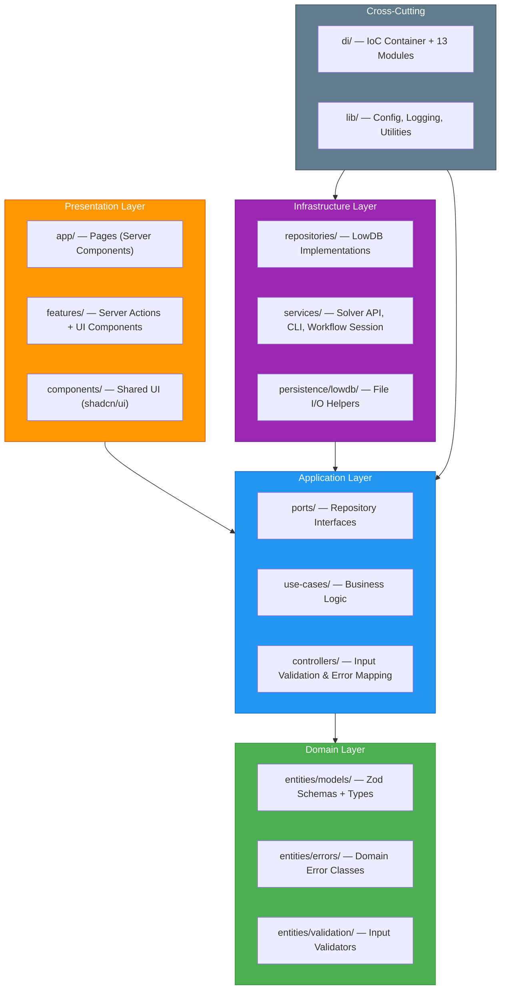

# Developer Guide

This guide is intended for developers who will take over and extend the StaffSchedulingWeb project.
It explains the architectural decisions, the folder structure, the Dependency Injection mechanism,
and provides a step-by-step walkthrough for adding new features.

---

## Architectural Overview

StaffSchedulingWeb implements **Clean Architecture** as described by
[Lazar Nikolov](https://github.com/nikolovlazar/nextjs-clean-architecture), adapted for
**Next.js 16** with Server Actions and the **@evyweb/ioctopus** Dependency Injection container.

The central principle is the **Dependency Rule**:

> Dependencies always point **inward**. An inner layer never imports from an outer layer.



---

## Layer-by-Layer Explanation

### 1. Domain Layer — `src/entities/`

The innermost layer. It contains the core business types and has **zero external dependencies**
(no React, no Next.js, no database code — only Zod for schema definitions).

| Subfolder | Contents |
|---|---|
| `models/` | Zod schemas and inferred TypeScript types for every entity (Employee, Schedule, Weights, etc.) |
| `errors/` | Typed domain error classes (`DomainError`, `ResourceNotFoundError`, `ValidationError`) |
| `validation/` | Pure input validators (e.g. month-year format regex, schedule ID format) |

**Example — `src/entities/models/employee.model.ts`:**

```ts
import { z } from 'zod';

export const EmployeeSchema = z.object({
  key: z.number(),
  firstname: z.string(),
  name: z.string(),
  type: z.string(),
});

export type Employee = z.infer<typeof EmployeeSchema>;
```

**Rules:**

- No `import` from `react`, `next/*`, `infrastructure/`, or any outer layer.
- Entities are pure data descriptions — no side effects, no I/O.

#### Error Hierarchy

The domain layer defines a hierarchy of typed errors that propagate through the architecture:

```
DomainError (base class)
├── ResourceNotFoundError     — entity not found in the database
├── ValidationError           — input fails Zod or custom validation
├── EmployeeNotFoundError     — specific employee key does not exist
├── ScheduleNotFoundError     — schedule ID does not exist
├── ScheduleAlreadyExistsError — duplicate schedule import
├── SolverNotConfiguredError  — solver integration disabled in config
├── SolveInfeasibleError      — solver cannot find a feasible schedule
└── TemplateNotFoundError     — template ID does not exist
```

All custom errors must extend `DomainError`. The `isDomainError()` type guard in
`src/entities/errors/base.errors.ts` is used by controllers to distinguish domain errors
from unexpected runtime errors.

### 2. Application Layer — `src/application/`

This layer orchestrates business logic. It is split into two concerns:

#### Ports (Repository Interfaces) — `src/application/ports/`

Ports define **what** the application needs, not **how** it is provided. Each port is a TypeScript
interface using only Domain types.

```ts
// src/application/ports/employee.repository.ts
import { Employee } from '@/src/entities/models/employee.model';

export interface IEmployeeRepository {
  getAll(caseId: number, monthYear: string): Promise<Employee[]>;
  getByKey(caseId: number, monthYear: string, key: number): Promise<Employee | null>;
  create(caseId: number, monthYear: string, employee: Employee): Promise<void>;
}
```

**All ports in the project:**

| Port | File |
|---|---|
| `ICaseRepository` | `case.repository.ts` |
| `IEmployeeRepository` | `employee.repository.ts` |
| `IScheduleRepository` | `schedule.repository.ts` |
| `IJobRepository` | `job.repository.ts` |
| `IWeightsRepository` | `weights.repository.ts` |
| `IMinimalStaffRepository` | `minimal-staff.repository.ts` |
| `IWishesAndBlockedRepository` | `wishes-and-blocked.repository.ts` |
| `IGlobalWishesAndBlockedRepository` | `global-wishes-and-blocked.repository.ts` |
| `IGlobalWishesTemplateRepository` | `global-wishes-template.repository.ts` |
| `IWeightsTemplateRepository` | `weights-template.repository.ts` |
| `IMinimalStaffTemplateRepository` | `minimal-staff-template.repository.ts` |
| `ISolverService` | `solver.service.ts` |
| `IScheduleParserService` | `schedule-parser.service.ts` |

#### Use Cases — `src/application/use-cases/`

Each use case is a **single business action** implemented as a factory function that receives its
repository dependencies and returns an executable function.

```ts
// src/application/use-cases/employees/get-all-employees.use-case.ts
import { Employee } from '@/src/entities/models/employee.model';
import { IEmployeeRepository } from '@/src/application/ports/employee.repository';

export interface IGetAllEmployeesUseCase {
  (input: { caseId: number; monthYear: string }): Promise<Employee[]>;
}

export function makeGetAllEmployeesUseCase(
  employeeRepository: IEmployeeRepository
): IGetAllEmployeesUseCase {
  return async ({ caseId, monthYear }) => {
    return employeeRepository.getAll(caseId, monthYear);
  };
}
```

**Rules:**

- One file = one use case = one business action.
- Dependencies are injected via the factory's parameters — never imported directly.
- Use cases **throw** Domain Errors; they do not catch them.
- No framework code (no HTTP, no React, no file system).

**Use case domains in the project:**

| Domain | Use Cases |
|---|---|
| Cases | `list-cases` |
| Employees | `get-all-employees`, `get-employee`, `create-employee` |
| Schedule | `get-schedule`, `get-schedules-metadata`, `save-schedule`, `delete-schedule`, `select-schedule`, `get-selected-schedule`, `update-schedule-metadata` |
| Solver | `check-solver-health`, `execute-solver-fetch`, `execute-solver-solve`, `execute-solver-solve-multiple`, `execute-solver-insert`, `execute-solver-delete`, `get-solver-progress`, `get-last-inserted-solution`, `import-solution` |
| Wishes & Blocked | `get-all-wishes`, `get-wishes-by-key`, `create-wishes`, `update-wishes`, `delete-wishes` |
| Global Wishes | `get-all-global-wishes`, `get-global-wishes-by-key`, `create-global-wishes`, `update-global-wishes`, `delete-global-wishes`, `import-global-wishes-template` |
| Weights | `get-weights`, `update-weights` |
| Minimal Staff | `get-minimal-staff`, `update-minimal-staff` |
| Templates | `list-*-templates`, `get-*-template`, `create-*-template`, `update-*-template`, `delete-*-template` (for weights, minimal-staff, global-wishes) |

### 3. Interface Adapters Layer — `src/controllers/`

Controllers are the **error boundary** of the architecture. They:

1. Receive raw input.
2. Validate it (using Zod or domain validators).
3. Call the use case.
4. **Catch** Domain Errors and convert them to UI-friendly messages.
5. Return a discriminated union: `{ data: T } | { error: string }`.

```ts
// src/controllers/employees/get-all-employees.controller.ts
import type { IGetAllEmployeesUseCase } from '@/src/application/use-cases/employees/get-all-employees.use-case';
import type { Employee } from '@/src/entities/models/employee.model';
import { isDomainError } from '@/src/entities/errors/base.errors';
import { validateMonthYear } from '@/src/entities/validation/input-validators';

export interface IGetAllEmployeesController {
  (input: { caseId: number; monthYear: string }): Promise<
    { data: Employee[] } | { error: string }
  >;
}

export function makeGetAllEmployeesController(
  getAllEmployeesUseCase: IGetAllEmployeesUseCase
): IGetAllEmployeesController {
  return async ({ caseId, monthYear }) => {
    try {
      validateMonthYear(monthYear);
      const employees = await getAllEmployeesUseCase({ caseId, monthYear });
      return { data: employees };
    } catch (error) {
      if (isDomainError(error)) return { error: error.message };
      throw error;
    }
  };
}
```

**Rules:**

- Controllers never leak internal stack traces or database errors to the frontend.
- All Domain Errors are caught here and converted into `{ error: string }`.
- Controllers return DTOs — never raw database objects.

### 4. Infrastructure Layer — `src/infrastructure/`

Concrete implementations of the ports defined in the Application layer.

| Subfolder | Contents |
|---|---|
| `repositories/` | Classes implementing `I*Repository` interfaces (e.g. `LowdbEmployeeRepository`) |
| `persistence/lowdb/` | Low-level file system helpers for reading/writing JSON files via LowDB |
| `services/` | External integrations (see below) |

**Services:**

| Service | File | Description |
|---|---|---|
| `SolverApiService` | `solver-api-service.ts` | HTTP client for the external Python solver's FastAPI server (port 8000). Used in API mode. |
| `PythonCliService` | `python-cli-service.ts` | Spawns the Python CLI as a child process. Used in CLI mode. |
| `WorkflowSessionService` | `workflow-session.service.ts` | Cookie-based session management for workflow mode. |

The choice between `SolverApiService` and `PythonCliService` is determined by the `config.json`
setting. See [Solver Integration](./solver-integration) for details on both modes.

**Example — `src/infrastructure/repositories/lowdb-employee.repository.ts`:**

```ts
import { IEmployeeRepository } from '@/src/application/ports/employee.repository';
import { Employee } from '@/src/entities/models/employee.model';
import { getEmployeeDb } from '@/src/infrastructure/persistence/lowdb/employees.db';

export class LowdbEmployeeRepository implements IEmployeeRepository {
  async getAll(caseId: number, monthYear: string): Promise<Employee[]> {
    const db = await getEmployeeDb(caseId, monthYear);
    return db.data.employees;
  }

  async getByKey(caseId: number, monthYear: string, key: number): Promise<Employee | null> {
    const db = await getEmployeeDb(caseId, monthYear);
    return db.data.employees.find((e) => e.key === key) ?? null;
  }

  async create(caseId: number, monthYear: string, employee: Employee): Promise<void> {
    const db = await getEmployeeDb(caseId, monthYear);
    db.data.employees.push(employee);
    await db.write();
  }
}
```

**Data storage convention:** Data is stored as JSON files under `cases/<case_id>/<month_year>/`.
Web-specific data (schedules, jobs) goes into the `web/` subdirectory.

### 5. Frameworks & Drivers Layer — `app/`, `features/`, `components/`, `di/`

This outermost layer contains framework-specific code.

#### DI Container — `di/`

The Dependency Injection container is built with **@evyweb/ioctopus**.

**`di/types.ts`** — Defines unique Symbols for every injectable and a return-type map:

```ts
export const DI_SYMBOLS = {
  IEmployeeRepository: Symbol.for('IEmployeeRepository'),
  IGetAllEmployeesUseCase: Symbol.for('IGetAllEmployeesUseCase'),
  IGetAllEmployeesController: Symbol.for('IGetAllEmployeesController'),
  // ... 120+ symbols for all repositories, use cases, controllers, and services
};
```

**`di/modules/*.module.ts`** — Each feature has a DI module that wires the dependency chain:

```ts
// di/modules/employees.module.ts
export function createEmployeesModule() {
  const m = createModule();

  m.bind(DI_SYMBOLS.IEmployeeRepository)
    .toClass(LowdbEmployeeRepository, [], 'singleton');

  m.bind(DI_SYMBOLS.IGetAllEmployeesUseCase)
    .toHigherOrderFunction(makeGetAllEmployeesUseCase, [DI_SYMBOLS.IEmployeeRepository]);

  m.bind(DI_SYMBOLS.IGetAllEmployeesController)
    .toHigherOrderFunction(makeGetAllEmployeesController, [DI_SYMBOLS.IGetAllEmployeesUseCase]);

  return m;
}
```

**`di/container.ts`** — Assembles the container from all modules and exports the `getInjection` helper:

```ts
import 'server-only';
import { createContainer } from '@evyweb/ioctopus';

const ApplicationContainer = createContainer();
ApplicationContainer.load(Symbol('EmployeesModule'), createEmployeesModule());
// ... all other modules

export function getInjection<K extends keyof typeof DI_SYMBOLS>(
  symbol: K
): DI_RETURN_TYPES[K] {
  return ApplicationContainer.get(DI_SYMBOLS[symbol]);
}
```

The `'server-only'` import guarantees the DI container is never bundled into client code.

#### Server Actions — `features/`

Server Actions are the **gateway** between the UI and the architecture. They retrieve a controller
from the DI container, execute it, and return the result.

```ts
// features/employees/employees.actions.ts
'use server';

import { getInjection } from '@/di/container';
import { Employee } from '@/src/entities/models/employee.model';

export async function getAllEmployeesAction(
  caseId: number,
  monthYear: string
): Promise<Employee[]> {
  const controller = getInjection('IGetAllEmployeesController');
  const result = await controller({ caseId, monthYear });
  if ('error' in result) throw new Error(result.error);
  return result.data;
}
```

#### Pages — `app/`

Pages are **Server Components** that call Server Actions to load data and pass it to client
components as props.

```ts
// app/employees/page.tsx
export default async function EmployeesPage({ searchParams }) {
  const { caseId, monthYear } = await searchParams;
  const employees = await getAllEmployeesAction(Number(caseId), monthYear);
  return <EmployeesPageClient employees={employees} />;
}
```

#### Client Components — `app/*-page-client.tsx` and `features/*/components/`

Client components handle user interaction and local state. They receive server-loaded data
as props and use hooks (`useState`, `useEffect`) for interactivity.

---

## Complete Folder Structure

```
StaffSchedulingWeb/
├── src/
│   ├── entities/                          ← Domain Layer
│   │   ├── models/                        ← Zod schemas + TS types
│   │   │   ├── employee.model.ts
│   │   │   ├── schedule.model.ts
│   │   │   ├── solver.model.ts
│   │   │   ├── weights.model.ts
│   │   │   ├── wishes-and-blocked.model.ts
│   │   │   ├── workflow.model.ts
│   │   │   ├── template.model.ts
│   │   │   ├── minimal-staff.model.ts
│   │   │   ├── case.model.ts
│   │   │   └── action-result.model.ts
│   │   ├── errors/                        ← Domain Errors
│   │   │   ├── base.errors.ts
│   │   │   ├── employee.errors.ts
│   │   │   ├── schedule.errors.ts
│   │   │   ├── solver.errors.ts
│   │   │   └── template.errors.ts
│   │   └── validation/
│   │       └── input-validators.ts
│   │
│   ├── application/                       ← Application Layer
│   │   ├── ports/                         ← Repository & Service Interfaces (13 files)
│   │   │   ├── employee.repository.ts
│   │   │   ├── schedule.repository.ts
│   │   │   ├── solver.service.ts
│   │   │   └── ...
│   │   └── use-cases/                     ← Business Logic (52 use cases)
│   │       ├── employees/
│   │       ├── schedule/
│   │       ├── solver/
│   │       ├── wishes-and-blocked/
│   │       ├── global-wishes/
│   │       ├── weights/
│   │       ├── minimal-staff/
│   │       ├── templates/
│   │       └── cases/
│   │
│   ├── controllers/                       ← Interface Adapters (56 controllers)
│   │   ├── employees/
│   │   ├── schedule/
│   │   ├── solver/
│   │   ├── wishes-and-blocked/
│   │   ├── global-wishes/
│   │   ├── weights/
│   │   ├── minimal-staff/
│   │   ├── templates/
│   │   └── cases/
│   │
│   └── infrastructure/                    ← Infrastructure Layer
│       ├── repositories/                  ← Port implementations (LowDB)
│       ├── persistence/lowdb/             ← File I/O helpers
│       └── services/                      ← External integrations
│           ├── solver-api-service.ts      ← HTTP client for Python solver API
│           ├── python-cli-service.ts      ← Direct Python CLI execution
│           └── workflow-session.service.ts ← Cookie-based session

├── di/                                    ← Dependency Injection
│   ├── container.ts                       ← Container assembly + getInjection()
│   ├── types.ts                           ← DI_SYMBOLS + DI_RETURN_TYPES
│   └── modules/                           ← Per-feature DI modules (13 modules)
│       ├── employees.module.ts
│       ├── schedules.module.ts
│       ├── solver.module.ts
│       └── ...

├── features/                              ← Server Actions + Feature Components
│   ├── employees/
│   │   ├── employees.actions.ts
│   │   ├── components/
│   │   └── utils/
│   ├── schedule/
│   ├── solver/
│   │   ├── solver.actions.ts
│   │   ├── components/
│   │   └── hooks/
│   │       └── use-solver-operations.ts   ← Complex solver execution state
│   ├── wishes_and_blocked/
│   ├── global_wishes_and_blocked/
│   ├── weights/
│   ├── minimal-staff/
│   ├── templates/
│   └── cases/

├── app/                                   ← Next.js App Router
│   ├── layout.tsx                         ← Root layout (reads workflow session)
│   ├── page.tsx                           ← Home page
│   ├── error.tsx                          ← Error boundary
│   ├── not-found.tsx                      ← 404 page
│   ├── employees/page.tsx
│   ├── schedule/page.tsx
│   ├── solver/page.tsx
│   ├── wishes-and-blocked/page.tsx
│   ├── global-wishes-and-blocked/page.tsx
│   ├── weights/page.tsx
│   ├── minimal-staff/page.tsx
│   ├── templates/page.tsx
│   ├── workflow/page.tsx
│   ├── globals.css
│   └── api/
│       ├── solver/status/route.ts         ← Proxy: polls Python solver /status
│       └── workflow/
│           ├── start/route.ts             ← Initiates workflow session
│           └── stop/route.ts              ← Clears workflow session

├── components/                            ← Shared UI Components
│   ├── ui/                                ← shadcn/ui primitives (21 components)
│   ├── InteractiveCalendar.tsx
│   ├── app-navigation.tsx
│   ├── case-selector.tsx
│   ├── employee-selector.tsx
│   ├── schedule-selector.tsx
│   ├── workflow-banner.tsx
│   └── ...                                ← 10+ dialog components

├── lib/                                   ← Shared Utilities
│   ├── config/
│   │   └── app-config.ts                  ← Configuration loader (config.json)
│   ├── logging/
│   │   └── logger.ts                      ← Logging utility
│   ├── services/
│   │   ├── global-to-current-wishes-converter.ts  ← Global → monthly wish conversion
│   │   └── schedule-parser.ts             ← Parses processed_solution JSON
│   ├── utils/
│   │   ├── case-utils.ts                  ← Case directory helpers
│   │   └── employee-matching.ts           ← Smart employee matching for template imports
│   └── utils.ts                           ← cn() class merge utility

├── config.json                            ← Runtime configuration
├── config.template.json                   ← Configuration template
├── .github/workflows/
│   ├── ci-check.yml                       ← Lint + Build CI (on every push/PR)
│   └── docs.yml                           ← Nextra docs deployment to GitHub Pages
└── docs/                                  ← This documentation site (Nextra 4.6)
```

### `lib/` Utilities

The `lib/` directory contains shared utilities used across layers:

| File | Description |
|---|---|
| `config/app-config.ts` | Loads `config.json` (or falls back to `config.template.json`). Provides `getCasePath()`, `getCasesDirectory()`, and solver configuration. |
| `logging/logger.ts` | Centralized logging utility used by infrastructure services. |
| `services/global-to-current-wishes-converter.ts` | Converts weekly global wish patterns into specific calendar dates for the current month. Called by the `create-global-wishes` and `update-global-wishes` use cases. |
| `services/schedule-parser.ts` | Parses the `processed_solution_*.json` format from the solver into the web app's internal `ScheduleSolution` model. |
| `utils/case-utils.ts` | Helpers for case directory listing, path construction, and month-year parsing. |
| `utils/employee-matching.ts` | Smart matching for template imports — matches employees by key first, then by name if keys differ between cases. |
| `utils.ts` | The `cn()` utility for merging Tailwind CSS class names (re-exported from `clsx` + `tailwind-merge`). |

---

## Architectural Rules

These rules must be followed in every change to maintain the separation of concerns.

### 1. Dependency Rule

| Layer | May import from | Must not import from |
|---|---|---|
| Domain (`entities/`) | Nothing (only `zod`) | Everything else |
| Application (`application/`) | Domain | Controllers, Infrastructure, App, Features |
| Controllers (`controllers/`) | Domain, Application | Infrastructure, App, Features |
| Infrastructure (`infrastructure/`) | Domain, Application (ports) | Controllers, App, Features |
| Frameworks (`app/`, `features/`, `di/`) | All layers | — |

### 2. Server Actions Are Gateways Only

Server Actions (`features/*/*.actions.ts`) must never contain business logic.
They retrieve a controller from the DI container and execute it:

```ts
// CORRECT
'use server';
export async function createProjectAction(data: InputType) {
  const controller = getInjection('ICreateProjectController');
  return controller(data);
}

// WRONG — business logic in a Server Action
'use server';
export async function createProjectAction(data: InputType) {
  const db = await getDatabase(); // ❌ Direct DB access
  const exists = await db.find(data.name); // ❌ Business logic
  if (exists) throw new Error('Exists'); // ❌ Error handling
  return db.insert(data); // ❌ Persistence
}
```

### 3. No Direct Database Access in Pages

Never import Prisma, LowDB, or any database client directly in `app/*.tsx` files.
All data fetching goes through Server Actions → Controllers → Use Cases → Repositories.

### 4. Controllers Are the Error Boundary

Domain Errors are thrown in Use Cases and caught in Controllers.
Controllers convert them to `{ error: string }` for the frontend.
Internal stack traces and database errors must never reach the UI.

### 5. One Use Case = One File = One Action

Each use case file exports exactly one factory function that performs a single business operation.
Complex workflows call multiple use cases in sequence — they don't merge logic into a single use case.

### 6. No Business Logic in UI Components

React components must not perform data aggregation (`reduce`, `filter` to compute statistics),
validation, or any domain logic. If a component needs computed data, the Controller must provide it.

---

## API Routes

The application exposes three API routes (Next.js App Router route handlers):

### GET `/api/solver/status`

Proxies solver status checks to the Python solver API's `/status` endpoint.
Used by the client-side polling mechanism during solve operations.

**Implementation:** `app/api/solver/status/route.ts`

### GET `/api/workflow/start`

Initiates workflow mode. Validates required query parameters, writes workflow state to httpOnly
cookies, and redirects to `/workflow`.

**Query Parameters:** `caseId`, `start` (DD.MM.YYYY), `end` (DD.MM.YYYY)

**Example:** `http://localhost:3000/api/workflow/start?caseId=77&start=01.11.2024&end=30.11.2024`

**Implementation:** `app/api/workflow/start/route.ts`

### GET `/api/workflow/stop`

Clears the workflow session cookies and redirects to the home page.

**Implementation:** `app/api/workflow/stop/route.ts`

### Workflow Session Mechanism

The workflow state is stored in httpOnly, sameSite=lax cookies:

| Cookie | Content |
|---|---|
| `workflow_mode` | `"true"` when workflow is active |
| `workflow_caseId` | Active case ID |
| `workflow_startDate` | Start date of the scheduling period |
| `workflow_endDate` | End date of the scheduling period |
| `workflow_monthYear` | Month-year string (e.g. `11_2024`) |

The root `layout.tsx` reads these cookies on every request to conditionally render the
`WorkflowBanner` component and modify navigation behavior.

**Implementation:** `src/infrastructure/services/workflow-session.service.ts`

---

## How to Add a New Feature

This section provides a step-by-step guide for adding a new feature to the project, using the
example of a hypothetical "Shift Type" entity. Follow the layers **inside-out**.

### Step 1 — Domain Model

Create `src/entities/models/shift-type.model.ts`:

```ts
import { z } from 'zod';

export const ShiftTypeSchema = z.object({
  id: z.string(),
  label: z.string(),
  startHour: z.number(),
  endHour: z.number(),
});

export type ShiftType = z.infer<typeof ShiftTypeSchema>;
```

### Step 2 — Repository Port

Create `src/application/ports/shift-type.repository.ts`:

```ts
import { ShiftType } from '@/src/entities/models/shift-type.model';

export interface IShiftTypeRepository {
  getAll(caseId: number, monthYear: string): Promise<ShiftType[]>;
  getById(caseId: number, monthYear: string, id: string): Promise<ShiftType | null>;
}
```

### Step 3 — Database Helper

Create `src/infrastructure/persistence/lowdb/shift-type.db.ts`:

```ts
import * as fs from 'fs/promises';
import { getCasePath } from '@/lib/config/app-config';

export async function readShiftTypes(caseId: number, monthYear: string) {
  const filePath = `${getCasePath(caseId, monthYear)}/shift_types.json`;
  try {
    const raw = await fs.readFile(filePath, 'utf-8');
    return JSON.parse(raw);
  } catch {
    return null;
  }
}
```

### Step 4 — Repository Implementation

Create `src/infrastructure/repositories/lowdb-shift-type.repository.ts`:

```ts
import { IShiftTypeRepository } from '@/src/application/ports/shift-type.repository';
import { ShiftType } from '@/src/entities/models/shift-type.model';
import { readShiftTypes } from '@/src/infrastructure/persistence/lowdb/shift-type.db';

export class LowdbShiftTypeRepository implements IShiftTypeRepository {
  async getAll(caseId: number, monthYear: string): Promise<ShiftType[]> {
    const data = await readShiftTypes(caseId, monthYear);
    return data?.shiftTypes ?? [];
  }

  async getById(caseId: number, monthYear: string, id: string): Promise<ShiftType | null> {
    const all = await this.getAll(caseId, monthYear);
    return all.find((s) => s.id === id) ?? null;
  }
}
```

### Step 5 — Use Case

Create `src/application/use-cases/shift-types/get-all-shift-types.use-case.ts`:

```ts
import { ShiftType } from '@/src/entities/models/shift-type.model';
import { IShiftTypeRepository } from '@/src/application/ports/shift-type.repository';

export interface IGetAllShiftTypesUseCase {
  (input: { caseId: number; monthYear: string }): Promise<ShiftType[]>;
}

export function makeGetAllShiftTypesUseCase(
  repo: IShiftTypeRepository
): IGetAllShiftTypesUseCase {
  return async ({ caseId, monthYear }) => {
    return repo.getAll(caseId, monthYear);
  };
}
```

### Step 6 — Controller

Create `src/controllers/shift-types/get-all-shift-types.controller.ts`:

```ts
import type { IGetAllShiftTypesUseCase } from '@/src/application/use-cases/shift-types/get-all-shift-types.use-case';
import type { ShiftType } from '@/src/entities/models/shift-type.model';
import { isDomainError } from '@/src/entities/errors/base.errors';
import { validateMonthYear } from '@/src/entities/validation/input-validators';

export interface IGetAllShiftTypesController {
  (input: { caseId: number; monthYear: string }): Promise<
    { data: ShiftType[] } | { error: string }
  >;
}

export function makeGetAllShiftTypesController(
  useCase: IGetAllShiftTypesUseCase
): IGetAllShiftTypesController {
  return async ({ caseId, monthYear }) => {
    try {
      validateMonthYear(monthYear);
      const data = await useCase({ caseId, monthYear });
      return { data };
    } catch (error) {
      if (isDomainError(error)) return { error: error.message };
      throw error;
    }
  };
}
```

### Step 7 — DI Registration

**`di/types.ts`** — Add the new symbols:

```ts
// Add to DI_SYMBOLS:
IShiftTypeRepository: Symbol.for('IShiftTypeRepository'),
IGetAllShiftTypesUseCase: Symbol.for('IGetAllShiftTypesUseCase'),
IGetAllShiftTypesController: Symbol.for('IGetAllShiftTypesController'),

// Add to DI_RETURN_TYPES:
IShiftTypeRepository: IShiftTypeRepository;
IGetAllShiftTypesUseCase: IGetAllShiftTypesUseCase;
IGetAllShiftTypesController: IGetAllShiftTypesController;
```

**`di/modules/shift-types.module.ts`** — Create the DI module:

```ts
import { createModule } from '@evyweb/ioctopus';
import { DI_SYMBOLS } from '@/di/types';
import { LowdbShiftTypeRepository } from '@/src/infrastructure/repositories/lowdb-shift-type.repository';
import { makeGetAllShiftTypesUseCase } from '@/src/application/use-cases/shift-types/get-all-shift-types.use-case';
import { makeGetAllShiftTypesController } from '@/src/controllers/shift-types/get-all-shift-types.controller';

export function createShiftTypesModule() {
  const m = createModule();

  m.bind(DI_SYMBOLS.IShiftTypeRepository)
    .toClass(LowdbShiftTypeRepository, [], 'singleton');

  m.bind(DI_SYMBOLS.IGetAllShiftTypesUseCase)
    .toHigherOrderFunction(makeGetAllShiftTypesUseCase, [DI_SYMBOLS.IShiftTypeRepository]);

  m.bind(DI_SYMBOLS.IGetAllShiftTypesController)
    .toHigherOrderFunction(makeGetAllShiftTypesController, [DI_SYMBOLS.IGetAllShiftTypesUseCase]);

  return m;
}
```

**`di/container.ts`** — Load the module:

```ts
import { createShiftTypesModule } from '@/di/modules/shift-types.module';
// ...
ApplicationContainer.load(Symbol('ShiftTypesModule'), createShiftTypesModule());
```

### Step 8 — Server Action

Create `features/shift-types/shift-types.actions.ts`:

```ts
'use server';

import { getInjection } from '@/di/container';
import { ShiftType } from '@/src/entities/models/shift-type.model';

export async function getAllShiftTypesAction(
  caseId: number,
  monthYear: string
): Promise<ShiftType[]> {
  const controller = getInjection('IGetAllShiftTypesController');
  const result = await controller({ caseId, monthYear });
  if ('error' in result) throw new Error(result.error);
  return result.data;
}
```

### Step 9 — Page (Server Component)

Create `app/shift-types/page.tsx`:

```tsx
import { getAllShiftTypesAction } from '@/features/shift-types/shift-types.actions';
import { ShiftTypesPageClient } from './shift-types-page-client';

export default async function ShiftTypesPage({
  searchParams,
}: {
  searchParams: Promise<{ caseId?: string; monthYear?: string }>;
}) {
  const { caseId, monthYear } = await searchParams;
  if (!caseId || !monthYear) return <div>Please select a case.</div>;

  const shiftTypes = await getAllShiftTypesAction(Number(caseId), monthYear);
  return <ShiftTypesPageClient shiftTypes={shiftTypes} />;
}
```

### Step 10 — Client Component

Create `app/shift-types/shift-types-page-client.tsx`:

```tsx
'use client';

import { useState } from 'react';
import { ShiftType } from '@/src/entities/models/shift-type.model';

interface Props {
  shiftTypes: ShiftType[];
}

export function ShiftTypesPageClient({ shiftTypes }: Props) {
  const [types] = useState<ShiftType[]>(shiftTypes);

  return (
    <div>
      <h1>Shift Types</h1>
      <ul>
        {types.map((t) => (
          <li key={t.id}>{t.label} ({t.startHour}:00 – {t.endHour}:00)</li>
        ))}
      </ul>
    </div>
  );
}
```

### Bonus — Adding a Write Operation

The tutorial above covers a read operation. For a **create/update** operation, the pattern extends
with additional error handling:

1. **Use case** — Performs validation, checks for duplicates, throws `ValidationError` or
   `ResourceAlreadyExistsError`.
2. **Controller** — Parses the input body with Zod (`schema.safeParse(input)`), catches domain errors.
3. **Server Action** — Passes the validated input to the controller and returns
   `{ success: true }` or `{ success: false, error: string }`.
4. **Client Component** — Calls the action via `useTransition`, shows success toast or error toast.

### Completion Checklist

After implementing a new feature, verify:

- [ ] Port method(s) added to repository interface
- [ ] DB helpers added (`*.db.ts`)
- [ ] Repository class implements the new port methods
- [ ] Use case(s) created with factory pattern
- [ ] Controller created with input validation and error boundary
- [ ] `DI_SYMBOLS` and `DI_RETURN_TYPES` updated in `di/types.ts`
- [ ] Module binding(s) added in `di/modules/`
- [ ] Module loaded in `di/container.ts`
- [ ] Server Action created with `'use server'` directive
- [ ] Page (Server Component) loads data and passes props
- [ ] Client component renders data and handles interaction
- [ ] `npx tsc --noEmit` exits with 0
- [ ] `npm run lint` exits with 0

---

## Data Flow Summary

The following table traces a single read operation (`getAllEmployees`) through every layer:

| Step | Layer | File | What happens |
|---|---|---|---|
| 1 | Page | `app/employees/page.tsx` | Server Component calls the Server Action |
| 2 | Action | `features/employees/employees.actions.ts` | Retrieves controller from DI, executes it |
| 3 | Controller | `src/controllers/employees/get-all-employees.controller.ts` | Validates input, calls use case, catches errors |
| 4 | Use Case | `src/application/use-cases/employees/get-all-employees.use-case.ts` | Calls repository port method |
| 5 | Repository | `src/infrastructure/repositories/lowdb-employee.repository.ts` | Reads from LowDB JSON file |
| 6 | DB Helper | `src/infrastructure/persistence/lowdb/employees.db.ts` | Low-level `fs.readFile` + `JSON.parse` |

Data flows back up the same chain in reverse (6 → 1), with the Controller transforming Domain Errors
into `{ error: string }` if necessary.

---

## Naming Conventions

| File type | Naming pattern | Example |
|---|---|---|
| Domain model | `<entity>.model.ts` | `employee.model.ts` |
| Domain error | `<entity>.errors.ts` | `schedule.errors.ts` |
| Port / Interface | `<entity>.repository.ts` | `employee.repository.ts` |
| Use case | `<action>.use-case.ts` | `get-all-employees.use-case.ts` |
| Controller | `<action>.controller.ts` | `get-all-employees.controller.ts` |
| DI module | `<feature>.module.ts` | `employees.module.ts` |
| Server Action | `<feature>.actions.ts` | `employees.actions.ts` |
| Page | `page.tsx` (Next.js convention) | `app/employees/page.tsx` |
| Client component | `*-page-client.tsx` | `employees-page-client.tsx` |
| DB helper | `<entity>.db.ts` | `employees.db.ts` |

All files use **kebab-case**.

---

## CI/CD

### Continuous Integration — `ci-check.yml`

Runs on **every push and pull request** to any branch:

1. **Lint** — `npm ci` + `npm run lint` (Node.js 24, ubuntu-latest)
2. **Build** — `npm ci` + `npm run build` (Node.js 24, ubuntu-latest)

Both jobs run in parallel. If either fails, the PR cannot be merged.

Before pushing, verify locally:

```bash
npm run lint
npx tsc --noEmit
npm run build
```

### Documentation Deployment — `docs.yml`

Triggers on pushes to `main` that modify files in the `docs/` directory:

1. Installs dependencies in `docs/`.
2. Builds the Nextra site (`npm run build`).
3. Runs pagefind for full-text search indexing.
4. Deploys to GitHub Pages via `peaceiris/actions-gh-pages`.

The live documentation is available at
[julian466.github.io/StaffSchedulingWeb](https://julian466.github.io/StaffSchedulingWeb/).

---

## Testing Strategy

> **Current state:** No tests exist in the web application. The Python solver project has a
> comprehensive test suite for all constraints (`tests/cp/constraints/`), but the Next.js frontend
> has no unit, integration, or end-to-end tests.

**Recommended approach for future development:**

1. **Use Cases** are the best starting point for unit tests. They are pure functions with injected
   dependencies, making them trivially mockable:
   ```ts
   const mockRepo = { getAll: vi.fn().mockResolvedValue([...]) };
   const useCase = makeGetAllEmployeesUseCase(mockRepo);
   const result = await useCase({ caseId: 77, monthYear: '11_2024' });
   expect(result).toEqual([...]);
   ```

2. **Controllers** can be tested to verify error mapping:
   ```ts
   const mockUseCase = vi.fn().mockRejectedValue(new ValidationError('Invalid'));
   const controller = makeGetAllEmployeesController(mockUseCase);
   const result = await controller({ caseId: 77, monthYear: 'invalid' });
   expect(result).toEqual({ error: 'Invalid' });
   ```

3. **Repositories** can be tested against temporary JSON files.

4. **E2E tests** with Playwright would cover the full workflow.

**Suggested tooling:** Vitest (compatible with Next.js 16) + Playwright for E2E.
