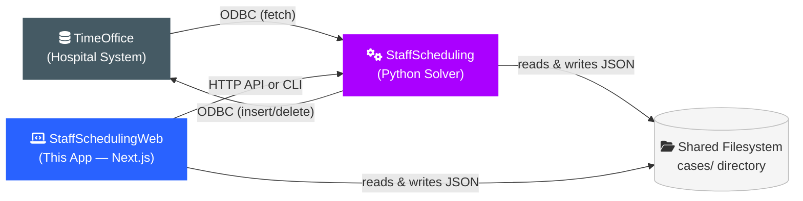

# StaffSchedulingWeb — Documentation

**A web-based interface for automated staff schedule generation in healthcare environments.**

---

## Overview

StaffSchedulingWeb is a modern Next.js web application that covers the complete staff scheduling workflow
in hospitals. It was developed as part of a collaboration between the **Chair of Combinatorial Optimization**
at RWTH Aachen University, **St. Marien-Hospital Düren**, and **Pradtke GmbH**. The project extends the
Python-based [StaffScheduling](https://github.com/CombiRWTH/StaffScheduling) optimization engine with a
full-featured user interface.

The application bridges every step between exporting employee data from the TimeOffice system and
re-importing a finalized, optimized schedule:

1. **Manage employee data** — Import and display employee rosters from TimeOffice exports.
2. **Define wishes & blocked periods** — Calendar-based input for shift preferences, days off, and unavailabilities.
3. **Generate schedules** — Integration with a Python CP-SAT constraint-programming solver.
4. **Compare & select plans** — Quality metrics, constraint violations, and wish-fulfillment rates.
5. **Deploy** — Export the optimal schedule for re-import into TimeOffice.

---

## System Context

The diagram below shows how the three main systems interact. Understanding these boundaries is
essential for both users and developers.

| System | Role | Technology |
|---|---|---|
| **TimeOffice** | Hospital staff management database. Source of employee data, shift definitions, and vacation records. Target for finalized schedules. | SQL Server (accessed via ODBC) |
| **StaffScheduling** | Constraint-programming solver. Fetches data from TimeOffice, optimizes shift assignments, and writes solutions. | Python 3.12, Google OR-Tools CP-SAT, FastAPI |
| **StaffSchedulingWeb** | Web interface for the entire workflow. Manages wishes, displays schedules, triggers solver operations. | Next.js 16, React 19, TypeScript, LowDB |

All three systems share data through a common `cases/` directory on the filesystem. The web application
communicates with the solver either via its REST API (FastAPI on port 8000) or by invoking the Python CLI
directly.

---

## Tech Stack

| Technology | Version | Purpose |
|---|---|---|
| **Next.js** | 16 | App Router, Server Components & Server Actions |
| **React** | 19 | UI rendering |
| **TypeScript** | 5.9 | Type safety (strict mode) |
| **Zod** | 4 | Schema validation & type inference |
| **@evyweb/ioctopus** | 1.3 | Dependency Injection container |
| **LowDB** | 7 | File-based JSON database |
| **Tailwind CSS** | 4 | Utility-first CSS framework |
| **Radix UI / shadcn/ui** | — | Accessible UI component primitives (New York style) |
| **react-hook-form** | 7.66 | Form state management |
| **date-fns** | 4.1 | Date manipulation |
| **next-themes** | 0.4 | Dark/light theme support |
| **sonner** | 2.0 | Toast notifications |
| **Nextra** | 4.6 | This documentation site |

---

## Structure of This Documentation

### [User Guide →](./user-guide)

Aimed at **end-users and academic reviewers**. Contains the complete installation and usage guide:
prerequisites, configuration, and the full scheduling workflow from start to finish.

### [Developer Guide →](./developer-guide)

Aimed at **developers who will take over and extend the project**. Explains the Clean Architecture layers,
the Dependency Injection mechanism, the folder structure, and a step-by-step tutorial for adding new features.

### [Underlying Data →](./underlying_data)

Reference documentation for **all JSON file structures** used by the system. Covers solver-side files,
web-managed files, and templates with full schema descriptions.

### [Solver Integration →](./solver-integration)

Technical reference for the **communication between the web app and the Python solver**. Covers the
FastAPI endpoints, CLI commands, progress tracking, and the solver's three-phase optimization process.

### [Troubleshooting →](./troubleshooting)

Common issues and their solutions for both users and developers.

---

## References

- **This project:** [github.com/Julian466/StaffSchedulingWeb](https://github.com/Julian466/StaffSchedulingWeb)
- **Solver project:** [github.com/CombiRWTH/StaffScheduling](https://github.com/CombiRWTH/StaffScheduling)
- **Solver documentation:** [CombiRWTH.github.io/StaffScheduling](https://combirwth.github.io/StaffScheduling/)
- **Clean Architecture reference:** [github.com/nikolovlazar/nextjs-clean-architecture](https://github.com/nikolovlazar/nextjs-clean-architecture/tree/main)
