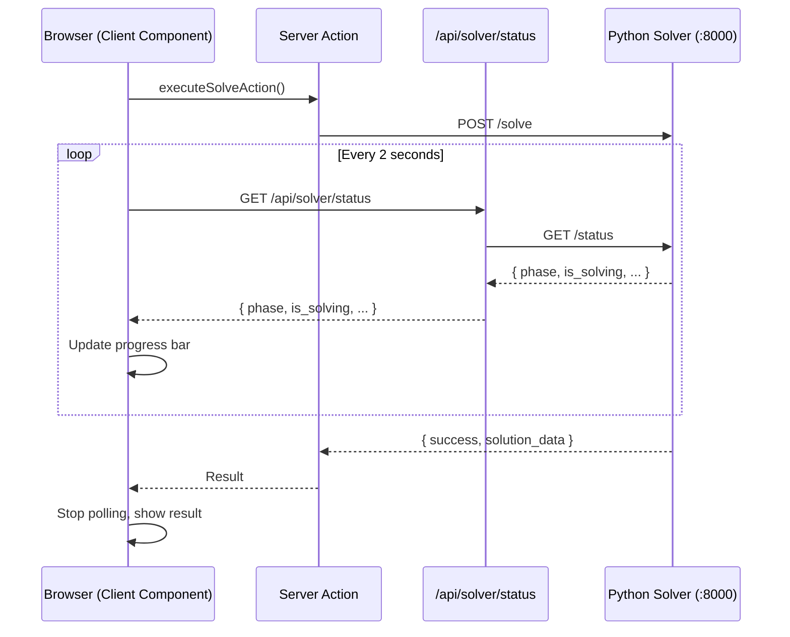

# Solver Integration

This page documents the technical interface between StaffSchedulingWeb (the Next.js frontend) and
the StaffScheduling Python solver. It covers both communication modes, the API protocol, the
solver's optimization process, and progress tracking.

---

## Communication Modes

The web application supports two modes for communicating with the solver, configured in `config.json`:

### Mode 1 — REST API (Recommended)

The solver runs as a standalone FastAPI server on port 8000. The web application sends HTTP requests
to execute operations and polls for progress.

```
StaffSchedulingWeb (Next.js :3000)
    │
    ├── POST /solve          →  FastAPI Server (:8000)
    ├── POST /solve-multiple →  FastAPI Server (:8000)
    ├── POST /fetch          →  FastAPI Server (:8000)
    ├── POST /insert         →  FastAPI Server (:8000)
    ├── POST /delete         →  FastAPI Server (:8000)
    └── GET  /status         →  FastAPI Server (:8000)  (polling)
```

**Starting the API server:**

```bash
cd /path/to/StaffScheduling
uv run staff-scheduling-api
```

The server starts on `http://127.0.0.1:8000` with auto-generated documentation at `/docs` (Swagger UI).

**Implementation in the web app:** `src/infrastructure/services/solver-api-service.ts`

### Mode 2 — Direct CLI Execution

The web application spawns the Python CLI as a child process. This mode does not require a running
server but blocks the Node.js process during execution.

```
StaffSchedulingWeb (Next.js :3000)
    │
    └── child_process.exec("uv run staff-scheduling solve 77 01.11.2024 30.11.2024")
```

**Implementation in the web app:** `src/infrastructure/services/python-cli-service.ts`

### Choosing a Mode

| Aspect | REST API | CLI |
|---|---|---|
| Setup complexity | Requires running a separate server | No extra process needed |
| Progress tracking | Real-time via `/status` polling | No progress feedback |
| Concurrent requests | Supported (async) | Blocks until completion |
| Recommended for | Production, Workflow mode | Development, quick testing |

---

## API Endpoints

### GET /status

Returns the current solver state. The web application polls this endpoint while a solve is in progress.

**Response:**

```json
{
  "is_solving": true,
  "phase": "phase_3_optimizing",
  "timeout_set_for_phase_3": 300,
  "weight_id": 1,
  "total_weights": 3
}
```

**Phase values:**

| Phase | Description |
|---|---|
| `"idle"` | Solver is not running |
| `"phase_1_upper_bound"` | Finding upper bound on hidden employees |
| `"phase_2_tight_bound"` | Tightening hidden employee count via binary search |
| `"phase_3_optimizing"` | Full optimization with all constraints and objectives |

### POST /solve

Runs a single optimization with the current weight configuration.

**Request:**

```json
{
  "unit": 77,
  "start_date": "2024-11-01",
  "end_date": "2024-11-30",
  "timeout": 300
}
```

**Response:**

```json
{
  "success": true,
  "status": "OPTIMAL",
  "solution_data": { },
  "log": "...",
  "stdout": "...",
  "console_output": "..."
}
```

The `solution_data` field contains the complete processed solution (same format as
`processed_solution_*.json` — see [Underlying Data](./underlying_data#webschedule_idjson)).

### POST /solve-multiple

Runs the solver three times with different weight presets (DEFAULT, BALANCED, STAFF_FOCUS).

**Request:** Same as `/solve`.

**Response:**

```json
{
  "success": true,
  "results": [
    { "weight_id": 0, "status": "OPTIMAL", "solution_data": { } },
    { "weight_id": 1, "status": "FEASIBLE", "solution_data": { } },
    { "weight_id": 2, "status": "OPTIMAL", "solution_data": { } }
  ],
  "log": "...",
  "stdout": "...",
  "console_output": "..."
}
```

Phases 1 and 2 (hidden employee determination) only run once — the results are reused across all
three weight configurations.

### POST /fetch

Exports data from the TimeOffice database into JSON files in the case directory.

**Request:**

```json
{
  "planning_unit": 77,
  "from_date": "2024-11-01",
  "till_date": "2024-11-30"
}
```

**Response:** `{ "success": true, "log": "...", "stdout": "...", "console_output": "..." }`

### POST /insert

Writes the selected schedule back to the TimeOffice database.

**Request:**

```json
{
  "planning_unit": 77,
  "from_date": "2024-11-01",
  "till_date": "2024-11-30",
  "solution_data": { }
}
```

The `solution_data` field is optional — if omitted, the solver reads the last processed solution
from disk.

### POST /delete

Removes the previously inserted schedule from the TimeOffice database. Request and response format
are the same as `/insert`.

---

## Three-Phase Solving Process

The solver uses **Google OR-Tools CP-SAT** (Constraint Programming with Boolean Satisfiability).
Each solve operation runs through three phases:

### Phase 1 — Upper Bound on Hidden Employees

"Hidden employees" are synthetic placeholder employees added to ensure the schedule is feasible
even when the real workforce is too small to meet minimum staffing requirements.

- Incrementally adds hidden employees (5 at a time) for each category (Fachkraft, Hilfskraft, Azubi).
- Runs a constraints-only check (no objectives, 5-second timeout) until feasibility is confirmed.
- Maximum: 50 hidden employees total.

### Phase 2 — Tight Bound on Hidden Employees

Binary search to find the minimum number of hidden employees needed:

- Reduces one category at a time while keeping others fixed.
- Result: the smallest number of hidden employees per category that still yields a feasible schedule.

### Phase 3 — Full Optimization

Builds the complete model with all constraints and objectives, then minimizes:

```
minimize( Σ weight_i × penalty_i )
```

Runs with the configured timeout (default: 300 seconds, configurable per request).

---

## Hard Constraints

These constraints **must** be satisfied — the solver returns INFEASIBLE if any are violated.

| Constraint | Description |
|---|---|
| **MaxOneShiftPerDay** | Each employee works at most one shift per day |
| **MinStaffing** | Minimum staff count per shift, per day, per employee category |
| **TargetWorkingTime** | Total monthly minutes per employee within ±460 of target |
| **VacationDaysAndShifts** | No work on vacation or forbidden days |
| **MinRestTime** | Late shift today → no early shift tomorrow |
| **FreeDayAfterNightShiftPhase** | Free day required after a night shift |
| **PlannedShifts** | Pre-assigned shifts from TimeOffice are fixed |
| **HierarchyOfIntermediateShifts** | Shift type hierarchy rules |
| **RoundsInEarlyShift** | Round-qualified employees must be assigned to early shifts |

## Soft Constraints (Objectives)

Penalties added to the objective function. The solver minimizes their weighted sum.

| Objective | Default Weight | Description |
|---|---|---|
| **MinimizeHiddenEmployees** | 100 | Minimize working time assigned to placeholder employees |
| **MinimizeOvertime** | 4 | Minimize deviation from target working hours |
| **MaximizeEmployeeWishes** | 3 | Minimize unfulfilled wish days and wish shifts |
| **FreeDaysAfterNightShiftPhase** | 3 | Encourage free days after night shift sequences |
| **FreeDaysNearWeekend** | 2 | Encourage free days adjacent to weekends |
| **MinimizeConsecutiveNightShifts** | 2 | Penalize consecutive night shifts (exponentially) |
| **NotTooManyConsecutiveDays** | 1 | Penalize more than 5 consecutive working days |
| **EverySecondWeekendFree** | 1 | Encourage alternating free weekends |
| **RotateShiftsForward** | 1 | Encourage forward rotation (Early → Late → Night) |

---

## Weight Presets

The `solve-multiple` command uses three built-in weight configurations:

| Weight Key | DEFAULT | BALANCED | STAFF_FOCUS |
|---|---|---|---|
| `hidden` | 100 | 50 | 80 |
| `overtime` | 4 | 10 | 1 |
| `wishes` | 3 | 3 | 5 |
| `after_night` | 3 | 1 | 3 |
| `free_weekend` | 2 | 5 | 0.1 |
| `consecutive_nights` | 2 | 1 | 5 |
| `consecutive_days` | 1 | 1 | 2 |
| `rotate` | 1 | 2 | 0 |
| `second_weekend` | 1 | 1 | 2 |

When running a single `solve`, the weights from the web application's Weights page are used instead.

---

## Progress Tracking in the Web Application

The web application implements progress tracking in `features/solver/hooks/use-solver-operations.ts`:

1. A `solve` or `solve-multiple` server action is called (this blocks until the solver finishes).
2. In parallel, the client component polls `GET /api/solver/status` (a Next.js API route that
   proxies to the Python solver's `GET /status`).
3. The `SolverProgressDisplay` component renders a progress bar with phase labels.
4. When the server action returns, polling stops and the result is processed.



> **Important:** Do not navigate away from the Solver or Workflow page while a solve is in progress.
> The polling and result handling depend on the component remaining mounted.

---

## CLI Commands Reference

If you prefer to run the solver from the command line instead of through the web interface:

```bash
# Fetch data from TimeOffice
uv run staff-scheduling fetch 77 01.11.2024 30.11.2024

# Single solve with default weights
uv run staff-scheduling solve 77 01.11.2024 30.11.2024

# Single solve with custom weights and timeout
uv run staff-scheduling solve 77 01.11.2024 30.11.2024 --weight hidden=200 --timeout 600

# Three solves with different weight presets
uv run staff-scheduling solve-multiple 77 01.11.2024 30.11.2024

# Write selected schedule to TimeOffice
uv run staff-scheduling insert 77 01.11.2024 30.11.2024

# Remove inserted schedule from TimeOffice
uv run staff-scheduling delete 77 01.11.2024 30.11.2024
```

Date format: `DD.MM.YYYY`. The unit number corresponds to the TimeOffice planning unit ID
(and the case directory name).
