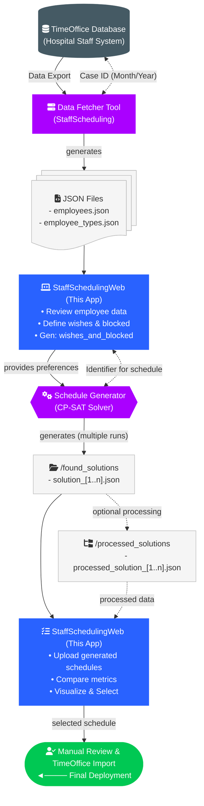

# User Guide

This guide walks you through installing, configuring, and using the StaffSchedulingWeb application
to manage employee schedules in a healthcare environment.

---

## Getting Started

### Prerequisites

| Requirement | Minimum Version | Recommended |
|---|---|---|
| **Node.js** | 20.x | 24.x (LTS) |
| **npm** | 9.x | 11.x |

Verify your installation:

```bash
node --version
npm --version
```

**Optional** — if you intend to run the constraint-programming solver:

| Requirement | Details |
|---|---|
| **Python** | 3.10+ (or the `uv` package runner) |
| **StaffScheduling** | The Python solver project ([repository](https://github.com/CombiRWTH/StaffScheduling)) |

### Installation

1. **Clone the repository**

```bash
git clone https://github.com/Julian466/StaffSchedulingWeb.git
cd StaffSchedulingWeb
```

2. **Install dependencies**

```bash
npm install
```

3. **Create a configuration file**

Copy the template and adjust the paths:

```bash
cp config.template.json config.json
```

Open `config.json` and set the cases directory:

```json
{
  "casesDirectory": "/cases",
  "staffSchedulingProject": {
    "include": false,
    "path": "-",
    "pythonExecutable": "uv"
  }
}
```

| Key | Description |
|---|---|
| `casesDirectory` | Path to the case data folder. Can be absolute (`C:\data\cases`) or relative to the project root (`/cases`). To share data with the StaffScheduling solver, point this to its `cases/` directory (e.g. `../StaffScheduling/cases`). |
| `staffSchedulingProject.include` | Set to `true` to enable solver integration. |
| `staffSchedulingProject.path` | Absolute path to the StaffScheduling Python project on disk. |
| `staffSchedulingProject.pythonExecutable` | The command used to invoke Python — `uv`, `python`, or `python3`. |

4. **Start the development server**

```bash
npm run dev
```

5. **Open the application**

Navigate to [http://localhost:3000](http://localhost:3000) in your browser.

### Building for Production

```bash
npm run build
npm start
```

The production server will be available at [http://localhost:3000](http://localhost:3000).

---

## Application Workflow

The diagram below shows how StaffSchedulingWeb fits into the larger scheduling pipeline. Each numbered
section below describes one phase of this workflow in detail.



### Phase 1 — Select a Case

A *Case* represents a single month of scheduling data for a specific hospital ward
(e.g. *Case 77, November 2024*).

1. Open the application in your browser.
2. Use the **Case Selector** dropdown in the top navigation bar.
3. Select an existing case **or** create a new one with the **"+"** button by specifying a month and year.

After selecting a case, all subsequent pages (Employees, Wishes, Schedule, etc.) operate on data
within that case.

> **Note:** Creating a new case via the "+" button will only trigger automatic data generation from TimeOffice if a solver connection is configured. Without a connected solver the case directory is created and you must populate the underlying JSON files manually (see [Underlying Data](./underlying_data)).

> 📸 **[Screenshot: Case Selection]**

### Phase 2 — Review Employee Data

Employee data is imported from TimeOffice via the StaffScheduling data fetcher tool. The web
application displays employees in a read-only table.

1. Navigate to **"Mitarbeiter"** (Employees) in the sidebar.
2. Browse the employee list showing ID, first name, last name, and role type
   (e.g. *Krankenschwester/-pfleger*, *Pflegeassistenz*).

The `type` field is not merely a display label — the solver uses it internally to classify each
employee into one of three staffing categories:

| Category | German | Description |
|---|---|---|
| **Fachkraft** | Skilled professional | Fully qualified nurses and care staff |
| **Hilfskraft** | Support worker | Assistants and auxiliary care personnel |
| **Azubi** | Trainee | Apprentices and students in training |

This classification determines which minimum staffing thresholds apply to each employee
(configured on the Minimum Staff page). Employee data is read-only in the web interface —
modifications must be made in TimeOffice and re-exported.

> 📸 **[Screenshot: Employees page showing the employee table with columns for ID, name, and type]**

### Phase 3 — Define Wishes & Blocked Periods

Wishes and blocked periods are employee preferences that the solver uses as constraints. There are
two distinct scopes — **global** (recurring weekly) and **monthly** (specific dates).

#### Understanding the Two Scopes

| Scope | Page | Pattern | Effect |
|---|---|---|---|
| **Global Wishes** | Globale Wünsche & Blockierungen | Weekday-based (Mon–Sun) | Applied to every matching weekday across all weeks of the selected month |
| **Monthly Wishes** | Wünsche & Blockierungen | Specific calendar dates | Applied only to the exact dates selected |

#### Preference Types

Both scopes support the same four preference types:

| Type | German Label | Constraint Strength | Meaning |
|---|---|---|---|
| **Wish Day** | Wunschtag | Soft (solver tries to honour) | Employee prefers to have this day off |
| **Blocked Day** | Blockierungstag | **Hard (mandatory)** | Employee must not work on this day |
| **Wish Shift** | Wunschschicht (F/S/N) | Soft | Employee prefers to work this specific shift |
| **Blocked Shift** | Blockierungsschicht (F/S/N) | **Hard (mandatory)** | Employee must not be assigned this shift |

> **Hard constraints** (`blocked_days`, `blocked_shifts`) are always enforced by the solver.
> **Soft constraints** (`wish_days`, `wish_shifts`) are optimised but may not always be satisfied.

#### ⚠️ Critical Workflow Order

**Always configure Global Wishes before Monthly Wishes.**

This is because saving or modifying a global wish for an employee **overwrites all monthly wishes
for that employee** in the current case with the regenerated global pattern. Specifically:

- Saving or updating a global wish entry → all existing monthly entries for that employee are **deleted** and replaced.
- Deleting an employee's global wish entry → all monthly entries for that employee are **deleted**.

This means if you have already entered specific monthly adjustments for an employee and then
modify their global wishes, those monthly adjustments will be lost.

**Recommended workflow:**
1. Enter all global wishes for all employees first.
2. Then open Monthly Wishes and add or adjust individual date-specific entries on top.
3. If you need to update a global wish again, you will need to re-enter any monthly overrides afterwards.

#### Entering Global Wishes

Global wishes represent a recurring weekly pattern — for example, "Employee X always wants
Tuesdays off".

1. Navigate to **"Globale Wünsche & Blockierungen"** (Global Wishes & Blocked).
2. Click **"Neuer Eintrag"** (New Entry).
3. Select the employee.
4. Choose the preference type and the weekday(s) (Monday–Sunday).
5. For shift-specific entries, also choose the shift type (**F** = Early, **S** = Late, **N** = Night).
6. Click **"Speichern"** (Save). The system immediately generates all corresponding monthly entries.

> 📸 **[Screenshot: Global Wishes page showing a weekly recurring pattern entry with weekday selector]**

#### Saving Global Wishes as a Template

If you want to reuse the same set of global wishes across different months or cases, you can
save them as a named template:

1. On the Global Wishes page, click **"Als Template speichern"** (Save as Template).
2. Give the template a descriptive name.
3. In a different month or case, open Global Wishes and click **"Template laden"** (Load Template)
   to overwrite the current global wishes with the saved set.

This is the recommended method for quickly setting up standard preference patterns for recurring
months without re-entering every entry manually.

#### Entering Monthly Wishes

1. Navigate to **"Wünsche & Blockierungen"** (Wishes & Blocked).
2. Click **"Neuer Eintrag"** (New Entry).
3. Select the employee.
4. Choose the preference type.
5. Use the interactive calendar to select specific dates within the current month.
6. For shift-specific entries, also choose the shift type.
7. Click **"Speichern"** (Save).

You can also edit or delete individual entries from the list at any time to override what was
generated from the global scope — but be aware that re-saving global wishes will reset these.

> 📸 **[Screenshot: Monthly Wishes page with the calendar interface open, showing selected dates
> highlighted and the shift type selector]**

### Phase 4 — Configure Solver Parameters

Before running the solver, review the constraint weights and minimum staffing levels.

#### Weights

Navigate to **"Gewichtung"** (Weights) to view and adjust penalty weights for soft constraints.
Higher weights cause the solver to prioritize avoiding specific violations (e.g. forward rotation,
consecutive night shifts).

> 📸 **[Screenshot: Weights configuration page showing sliders or input fields for constraint weights]**

#### Minimum Staff

Navigate to **"Mindestbesetzung"** (Minimum Staff) to define the minimum number of employees required
per shift type (F, S, N) for each day of the week.

> 📸 **[Screenshot: Minimum Staff page showing the staffing matrix with shift types as columns
> and weekdays as rows]**

#### Templates

Both weights and minimum staff configurations can be saved as **templates** for reuse across cases.
Use the template dialogs to save, load, or import presets.

> 📸 **[Screenshot: Template save/load dialog]**

> **Important — Weights and `solve-multiple`:** The weights configuration only affects the
> **`solve`** command (single schedule generation). When using **`solve-multiple`**, the solver
> ignores this configuration and instead runs three internal fixed weight presets automatically.
> Adjusting weights is therefore only relevant when running a single solve.

### Phase 5 — Generate Schedules

Schedules are generated by the StaffScheduling Python solver. The web application offers two
modes for interacting with the solver.

#### Solver Operations

In both modes (Workflow and Solver page) you have access to the same set of operations:

| Operation | German Label | Description |
|---|---|---|
| **Fetch** | Daten holen | Pulls the latest employee and constraint data from the TimeOffice database into the case directory |
| **Solve** | Dienstplan berechnen | Runs the solver once with the current weights and settings to generate a single schedule. After completion the app asks whether you want to import the result immediately |
| **Solve Multiple** | Mehrere Dienstpläne berechnen | Runs the solver three times using three fixed internal weight configurations. All resulting schedules are automatically imported and can be compared on the Schedule page |
| **Insert** | Einfügen | Writes the currently *selected* schedule (see Phase 6) back to the TimeOffice database |
| **Delete** | Löschen | Removes the last inserted schedule from the TimeOffice database and resets the insertion state |

> ⚠️ **Do not navigate away from the Solver or Workflow page while a solve is in progress.**
> The application polls for the result after completion; leaving the page means the finished
> schedule will not be imported automatically.

#### Option A — Workflow Mode

Workflow mode is the intended end-to-end flow for connected TimeOffice installations.

**Activation:**
- Clicking the wizard icon in TimeOffice triggers the workflow automatically, **or**
- Navigate manually to the start URL:  
  `http://localhost:3000/api/workflow/start?caseId=77&start=01.11.2024&end=30.11.2024`
- To stop the workflow session: `http://localhost:3000/api/workflow/stop`

While workflow mode is active, a banner appears at the top of every page indicating the active
case and date range. Navigate to **"Workflow"** to run the solver pipeline.

> 📸 **[Screenshot: Workflow page with the workflow banner and solver pipeline steps (Fetch / Solve / Insert)]**

#### Option B — Solver Page (Manual / Developer Mode)

The Solver page provides the same operations without requiring an active workflow session.
It is primarily intended for development, testing, and manual scheduling scenarios.

> 📸 **[Screenshot: Solver page showing fetch, solve, solve-multiple, insert, and delete buttons]**

#### Option C — Manual File Import

If you have already run the solver externally (e.g. on a different machine), you can import
the resulting `processed_solution_*.json` files directly on the **Schedule page** without
going through the solver operations at all (see Phase 6 — Manual Upload).

### Phase 6 — Compare & Select Schedules

After importing schedules, the Schedule page provides comprehensive analysis and selection tools.

#### Manual Upload

If you missed the automatic import prompt after a solve, or if you have externally generated
schedules, you can upload them manually:

1. Navigate to **"Dienstplan"** (Schedule).
2. Click **"Upload"** and select a `processed_solution_*.json` file from the solver's
   `processed_solutions/` output directory.

> 📸 **[Screenshot: Schedule page with the upload button and file picker dialog]**

#### Viewing a Schedule

Use the **Schedule Selector** dropdown to switch between all imported schedules for the current case.

The schedule matrix shows a day-by-day, employee-by-employee grid with colour-coded cells:

| Code | Shift | Description |
|---|---|---|
| **F** | Früh (Early) | Morning shift |
| **S** | Spät (Late) | Afternoon/evening shift |
| **N** | Nacht (Night) | Night shift |
| *(empty)* | Day off | No assignment |

The calendar view also renders wish and blocked information directly in the cells so you can
spot conflicts at a glance:

| Symbol | Meaning |
|---|---|
| ● Circle on a shift cell | Blocked shift (hard constraint) |
| ◆ Diamond on a shift cell | Wished shift (soft preference) |
| Red-highlighted day | Blocked day (employee must not work) |
| Small triangle indicator | Wish day (employee prefers to be off) |

> 📸 **[Screenshot: Schedule detail view with the shift matrix and wish/blocked symbols visible in cells]**

#### Comparing Schedules

1. Click **"Alle Pläne"** (All Schedules) to open the overview dialog.
2. View quality statistics side by side for all imported schedules:

| Metric | Description |
|---|---|
| Forward Rotation Violations | Shifts should rotate F → S → N — violations of this rule |
| Consecutive Working Days > 5 | Employees working more than five days in a row |
| Free Weekend Violations | Weekends where no two consecutive free days were given |
| Free Days Near Weekend | Days off not grouped close to weekends |
| Not Free After Night Shift | Cases where no recovery day was granted after a night shift |
| Consecutive Night Shifts > 3 | Too many night shifts in a row |
| Total Overtime Hours | Sum of overtime across all employees |
| Violated Wishes | Number of soft-constraint wishes that could not be satisfied |

3. In the same dialog you can **add or edit a description** for each schedule to help distinguish
   them (e.g. "Variant with fewer night violations"), and **delete** schedules you no longer need.

> 📸 **[Screenshot: All Schedules dialog showing metrics table, description column, and delete buttons]**

#### Compact / Comparison Views

- **Compact view:** A condensed version of the shift matrix suitable for printing or quick review.
- **Compare view** ("Dienstpläne vergleichen"): Displays assigned shifts per employee stacked
  vertically across all loaded schedules, making it easy to spot per-employee differences between
  variants.

> 📸 **[Screenshot: Compare view showing two schedules side by side with per-employee shift rows]**

#### Selecting the Optimal Schedule

After reviewing the metrics and visual matrix:

1. Choose the schedule that best balances low violations and high wish fulfillment.
2. Click **"Auswählen"** (Select) to mark it as the active schedule for this case.
3. The selected plan is persisted and will be used for the **Insert** operation (Phase 5).

> 📸 **[Screenshot: Schedule page with the selection banner indicating the currently active schedule]**

### Phase 7 — Deploy the Schedule

After selecting the optimal schedule:

1. The selected schedule is persisted and marked as the active plan for the case.
2. Export the schedule JSON file from the `cases/<case_id>/<month_year>/web/` directory.
3. Use the StaffScheduling insert tool to write the schedule back to TimeOffice.
4. Perform a final manual review in TimeOffice before publishing to staff.

> 📸 **[Screenshot: Schedule page with a banner indicating the currently selected/active schedule]**

---

## Quick Reference — Navigation Structure

| Page | Path | Purpose |
|---|---|---|
| Home | `/` | Case selection and overview |
| Employees | `/employees` | View employee roster |
| Wishes & Blocked | `/wishes-and-blocked` | Monthly per-employee preferences |
| Global Wishes | `/global-wishes-and-blocked` | Recurring weekly preferences |
| Weights | `/weights` | Solver constraint weights |
| Minimum Staff | `/minimal-staff` | Minimum staffing levels |
| Templates | `/templates` | Saved configuration presets |
| Schedule | `/schedule` | View, compare, and select schedules |
| Workflow | `/workflow` | Automated solver pipeline |
