# User Guide

This guide walks you through installing, configuring, and using the StaffSchedulingWeb application
to manage employee schedules in a healthcare environment.

---

## Getting Started

### Prerequisites

Before installing, please check these two tools:

| Requirement | Minimum Version | Recommended |
|---|---|---|
| **Node.js** | 20.x | 24.x (LTS) |
| **npm** | 9.x | 11.x |

### Which Node.js version should I install?

- **Recommended:** Node.js **24 LTS**
- **Minimum supported:** Node.js **20.x**

If you are unsure, install the **LTS version** shown on the Node.js website.

### Install Node.js (simple)

1. Open [https://nodejs.org/en/download/](https://nodejs.org/en/download/)
2. Download and install the **LTS** version (not “Current”)
3. Keep the default installer options
4. Close and reopen your terminal after installation

### OS-specific hints

- **macOS:** Download the `.pkg` installer from nodejs.org and open it.
- **Windows:** Download the `.msi` installer from nodejs.org and run it as usual.
- **Linux:** Use the package manager instructions on nodejs.org for your distribution.

### Verify installation

Run:

```bash
node --version
npm --version
```

Expected output example:

- `node --version` → `v24.x.x` (recommended) or at least `v20.x.x`
- `npm --version` → `9.x` or higher

If both commands print a version number in that range, you are ready.

> If a command says “not found”, close and reopen your terminal and try again.

**Optional (only if you want to run the Python solver directly):**

| Requirement | Details |
|---|---|
| **Python** | 3.12+ (or the `uv` package runner) |
| **StaffScheduling** | The Python solver project ([repository](https://github.com/CombiRWTH/StaffScheduling)) |

### Installation (Beginner-Friendly)

Follow these steps in order.

1. **Download the project**

```bash
git clone https://github.com/Julian466/StaffSchedulingWeb.git
cd StaffSchedulingWeb
```

2. **Install all required packages**

```bash
npm install
```

This can take a few minutes.

3. **Create your local config file**

```bash
cp config.template.json config.json
```

If `cp` does not work on your system, copy `config.template.json` manually and rename the copy to `config.json`.

4. **Set a simple default config (without solver)**

Open `config.json` and make sure it looks like this:

```json
{
    "casesDirectory": "/cases",
    "staffSchedulingProject": {
        "include": false,
        "path": "-",
        "pythonExecutable": "uv"
    },
    "solverMode": "api"
}
```

This setup is the easiest start because it runs the web app with local sample data and without requiring a Python solver.

### If you want real data from the solver

For productive/real scheduling data, you must adjust `config.json`:

1. Set `staffSchedulingProject.include` to `true`
2. Set `staffSchedulingProject.path` to your local **StaffScheduling** project folder
3. Set `casesDirectory` to the shared `cases/` folder used by the solver

Example:

```json
{
    "casesDirectory": "../StaffScheduling/cases",
    "staffSchedulingProject": {
        "include": true,
        "path": "/absolute/path/to/StaffScheduling",
        "pythonExecutable": "uv"
    },
    "solverMode": "api"
}
```

After this, use **Fetch** on the Solver page to load current data for your case.

5. **Start the application**

```bash
npm run dev
```

6. **Open it in your browser**

Go to [http://localhost:3000](http://localhost:3000)

If you see the StaffSchedulingWeb start page, installation is complete.

### Config Fields (Explained Simply)

| Key | Meaning |
|---|---|
| `casesDirectory` | Folder that contains your case data. Use `/cases` for the built-in sample data in this repository. |
| `staffSchedulingProject.include` | `false` = do not use the Python solver. `true` = enable solver integration. |
| `staffSchedulingProject.path` | Absolute path to your local StaffScheduling Python project. Needed only when `include` is `true`. |
| `staffSchedulingProject.pythonExecutable` | Python command to run (`uv`, `python`, or `python3`). Needed only when `include` is `true`. |
| `solverMode` | How the web app talks to the solver: `"cli"` or `"api"`. See [Solver Integration](./solver-integration#configuring-the-solver-mode). |

> If you use solver mode `"api"`, the app will try to start the solver API automatically when needed. Make sure `staffSchedulingProject.path` and `staffSchedulingProject.pythonExecutable` are set correctly.

### Building for Production

```bash
npm run build
npm start
```

The production server will be available at [http://localhost:3000](http://localhost:3000).

---

## Quick Start — Your First Schedule

If you want to try the application immediately without a TimeOffice connection, the repository
includes sample data for **Case 77, November 2024**. Follow these steps:

1. Complete the installation above (set `casesDirectory` to `/cases` and leave solver `include`
    as `false`).
2. Start the dev server (`npm run dev`) and open `http://localhost:3000`.
3. In the **Case Selector**, choose **Case 77 — 11/2024**.
4. Navigate to **Mitarbeiter** — you should see the sample employee list.
5. Navigate to **Wünsche & Blockierungen** — view or add wishes for individual employees.
6. Navigate to **Dienstplan** — if you have a `processed_solution_*.json` file from a prior
    solver run, click **Upload** to import it.

To generate new schedules, you need a working solver connection (see the
[Solver Integration](./solver-integration) page).

---

## Application Workflow

The diagram below shows how StaffSchedulingWeb fits into the larger scheduling pipeline. Each numbered
section below describes one phase of this workflow in detail.

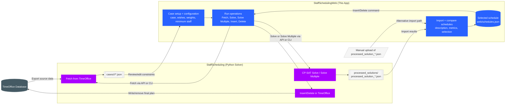

### Phase 1 — Select a Case

A *Case* represents a single month of scheduling data for a specific hospital ward
(e.g. *Case 77, November 2024*).

1. Open the application in your browser.
2. Use the **Case Selector** dropdown in the top navigation bar.
3. Select an existing case **or** create a new one with the **"+"** button by specifying a month and year.

After selecting a case, all subsequent pages (Employees, Wishes, Schedule, etc.) operate on data
within that case.

> **Note:** Creating a new case via the "+" button will only trigger automatic data generation from TimeOffice if a solver connection is configured. Without a connected solver the case directory is created and you must populate the underlying JSON files manually (see [Underlying Data](./underlying_data)).


<figure style={{ margin: "40px 0", marginLeft: "auto", marginRight: "auto", maxWidth: "400px" }}>
    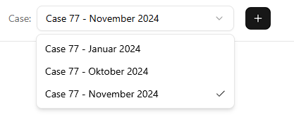
</figure>

### Phase 2 — Review Employee Data

Employee data is imported from TimeOffice via the StaffScheduling data fetcher tool. The web
application displays employees in a read-only table.

1. Navigate to **"Mitarbeiter"** (Employees) in the sidebar.
2. Browse the employee list showing ID, first name, last name, and role type
   (e.g. *Krankenschwester/-pfleger*, *Pflegeassistenz*).

The `type` field is not merely a display label — the solver uses it internally to classify each
employee into one of three staffing categories:

| Category | German | Description |
|---|---|---|
| **Fachkraft** | Skilled professional | Fully qualified nurses and care staff |
| **Hilfskraft** | Support worker | Assistants and auxiliary care personnel |
| **Azubi** | Trainee | Apprentices and students in training |

This classification determines which minimum staffing thresholds apply to each employee
(configured on the Minimum Staff page). Employee data is read-only in the web interface —
modifications must be made in TimeOffice and re-exported.

<figure style={{ margin: "40px 0", marginLeft: "auto", marginRight: "auto" }}>
    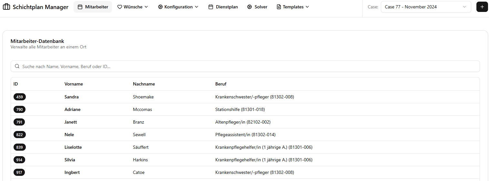
</figure>

### Phase 3 — Define Wishes & Blocked Periods

Wishes and blocked periods are employee preferences that the solver uses as constraints. There are
two distinct scopes — **global** (recurring weekly) and **monthly** (specific dates).

#### Understanding the Two Scopes

| Scope | Page | Pattern | Effect |
|---|---|---|---|
| **Global Wishes** | Globale Wünsche & Blockierungen | Weekday-based (Mon–Sun) | Applied to every matching weekday across all weeks of the selected month |
| **Monthly Wishes** | Wünsche & Blockierungen | Specific calendar dates | Applied only to the exact dates selected |

#### Preference Types

Both scopes support the same four preference types:

| Type | German Label | Constraint Strength | Meaning |
|---|---|---|---|
| **Wish Day** | Wunschtag | Soft (solver tries to honour) | Employee prefers to have this day off |
| **Blocked Day** | Blockierungstag | **Hard (mandatory)** | Employee must not work on this day |
| **Wish Shift** | Wunschschicht (F/S/N) | Soft | Employee prefers to work this specific shift |
| **Blocked Shift** | Blockierungsschicht (F/S/N) | **Hard (mandatory)** | Employee must not be assigned this shift |

> **Hard constraints** (`blocked_days`, `blocked_shifts`) are always enforced by the solver.
> **Soft constraints** (`wish_days`, `wish_shifts`) are optimised but may not always be satisfied.

#### ⚠️ Critical Workflow Order

**Always configure Global Wishes before Monthly Wishes.**

This is because saving or modifying a global wish for an employee **overwrites all monthly wishes
for that employee** in the current case with the regenerated global pattern. Specifically:

- Saving or updating a global wish entry → all existing monthly entries for that employee are **deleted** and replaced.
- Deleting an employee's global wish entry → all monthly entries for that employee are **deleted**.

This means if you have already entered specific monthly adjustments for an employee and then
modify their global wishes, those monthly adjustments will be lost.

**Recommended workflow:**
1. Enter all global wishes for all employees first.
2. Then open Monthly Wishes and add or adjust individual date-specific entries on top.
3. If you need to update a global wish again, you will need to re-enter any monthly overrides afterwards.

#### Entering Global Wishes

Global wishes represent a recurring weekly pattern — for example, "Employee X always wants
Tuesdays off".

1. Navigate to **"Globale Wünsche & Blockierungen"** (Global Wishes & Blocked).
2. Click **"Neuer Eintrag"** (New Entry).
3. Select the employee.
4. Choose the preference type and the weekday(s) (Monday–Sunday).
5. For shift-specific entries, also choose the shift type (**F** = Early, **S** = Late, **N** = Night).
6. Click **"Speichern"** (Save). The system immediately generates all corresponding monthly entries.

<figure style={{ margin: "40px 0", marginLeft: "auto", marginRight: "auto" }}>
    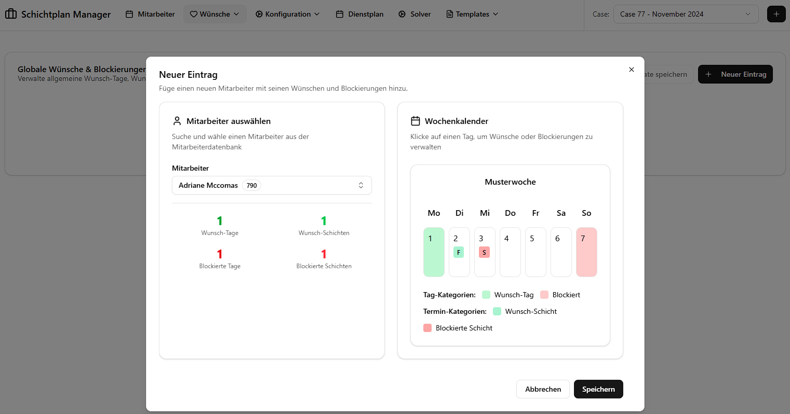
</figure>

#### Saving Global Wishes as a Template

If you want to reuse the same set of global wishes across different months or cases, you can
save them as a named template:

1. On the Global Wishes page, click **"Als Template speichern"** (Save as Template).
2. Give the template a descriptive name.
3. In a different month or case, open Global Wishes and click **"Template laden"** (Load Template)
   to overwrite the current global wishes with the saved set.

This is the recommended method for quickly setting up standard preference patterns for recurring
months without re-entering every entry manually.

#### Entering Monthly Wishes

1. Navigate to **"Wünsche & Blockierungen"** (Wishes & Blocked).
2. Click **"Neuer Eintrag"** (New Entry).
3. Select the employee.
4. Choose the preference type.
5. Use the interactive calendar to select specific dates within the current month.
6. For shift-specific entries, also choose the shift type.
7. Click **"Speichern"** (Save).

You can also edit or delete individual entries from the list at any time to override what was
generated from the global scope — but be aware that re-saving global wishes will reset these.

<figure style={{ margin: "40px 0", marginLeft: "auto", marginRight: "auto" }}>
    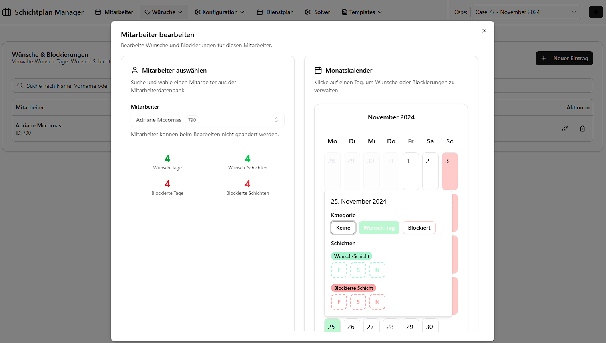
</figure>

### Phase 4 — Configure Solver Parameters

Before running the solver, review the constraint weights and minimum staffing levels.

#### Weights

Navigate to **"Gewichtung"** (Weights) to view and adjust penalty weights for soft constraints.
Higher weights cause the solver to prioritize avoiding specific violations (e.g. forward rotation,
consecutive night shifts).

The available weights and their meaning:

| Weight | Description | Default |
|---|---|---|
| `free_weekend` | Penalty for not granting a free weekend | 2 |
| `consecutive_nights` | Penalty for more than 3 consecutive night shifts | 2 |
| `hidden` | Internal penalty for using placeholder (hidden) employees | 100 |
| `overtime` | Penalty per hour of overtime | 4 |
| `consecutive_days` | Penalty for more than 5 consecutive working days | 1 |
| `rotate` | Penalty for violating forward rotation (F → S → N) | 1 |
| `wishes` | Penalty per unfulfilled employee wish | 15 |
| `after_night` | Penalty for no free day after a night shift | 3 |
| `second_weekend` | Penalty for working a second weekend in the month | 1 |

<figure style={{ margin: "40px 0", marginLeft: "auto", marginRight: "auto" }}>
    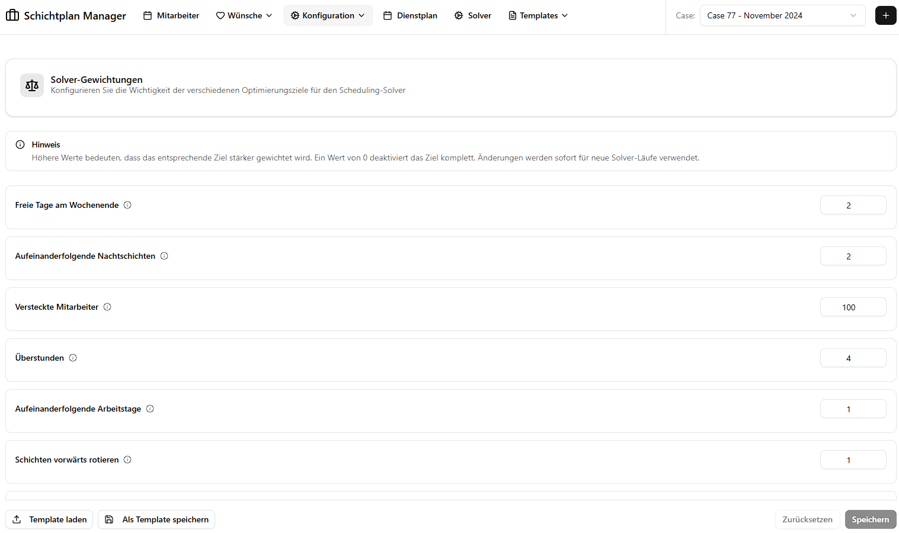
</figure>

#### Minimum Staff

Navigate to **"Mindestbesetzung"** (Minimum Staff) to define the minimum number of employees required
per shift type (F, S, N) for each day of the week, broken down by employee category
(Fachkraft, Hilfskraft, Azubi).

These are **hard constraints** — the solver will return INFEASIBLE if it cannot meet the
minimum staffing requirements with the available employees. If you encounter INFEASIBLE results,
try reducing these values first.

<figure style={{ margin: "40px 0", marginLeft: "auto", marginRight: "auto" }}>
    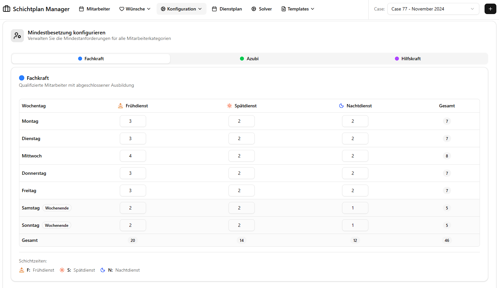
</figure>

#### Templates

Both weights and minimum staff configurations can be saved as **templates** for reuse across cases.
Use the template dialogs to save, load, or import presets.

<figure style={{ margin: "40px 0", marginLeft: "auto", marginRight: "auto" }}>

</figure>
<div style={{ margin: "40px 0", display: "flex", justifyContent: "center", gap: "20px" }}>
    <div style={{ width: "45%" }}>
        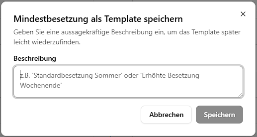
    </div>
    <div style={{ width: "45%" }}>
        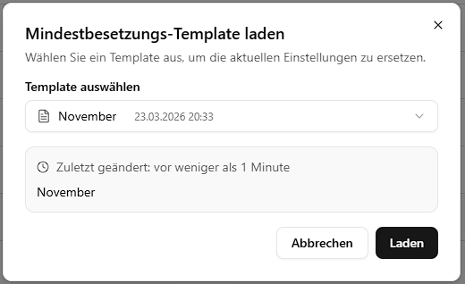
    </div>
</div>


> **Important — Weights and `solve-multiple`:** The weights configuration only affects the
> **`solve`** command (single schedule generation). When using **`solve-multiple`**, the solver
> ignores this configuration and instead runs three internal fixed weight presets automatically.
> Adjusting weights is therefore only relevant when running a single solve.
> For details on the three presets, see [Solver Integration — Weight Presets](./solver-integration#weight-presets).

### Phase 5 — Generate Schedules

Schedules are generated by the StaffScheduling Python solver. The web application offers two
modes for interacting with the solver.

#### Solver Operations

In both modes (Workflow and Solver page) you have access to the same set of operations:

| Operation | German Label | Description |
|---|---|---|
| **Fetch** | Daten holen | Pulls the latest employee and constraint data from the TimeOffice database into the case directory |
| **Solve** | Dienstplan berechnen | Runs the solver once with the current weights and settings to generate a single schedule. After completion the app asks whether you want to import the result immediately |
| **Solve Multiple** | Mehrere Dienstpläne berechnen | Runs the solver three times using three fixed internal weight configurations. All resulting schedules are automatically imported and can be compared on the Schedule page |
| **Insert** | Einfügen | Writes the currently *selected* schedule (see Phase 6) back to the TimeOffice database |
| **Delete** | Löschen | Removes the last inserted schedule from the TimeOffice database and resets the insertion state |

> ⚠️ **Do not navigate away from the Solver or Workflow page while a solve is in progress.**
> The application polls for the result after completion; leaving the page means the finished
> schedule will not be imported automatically.

#### Option A — Workflow Mode

Workflow mode is the intended end-to-end flow for connected TimeOffice installations.

**Activation:**
- Clicking the wizard icon in TimeOffice triggers the workflow automatically, **or**
- Navigate manually to the start URL:  
  `http://localhost:3000/api/workflow/start?caseId=77&start=01.11.2024&end=30.11.2024`
- To stop the workflow session: `http://localhost:3000/api/workflow/stop`

While workflow mode is active, a banner appears at the top of every page indicating the active
case and date range. Navigate to **"Workflow"** to run the solver pipeline.

<figure style={{ margin: "40px 0", marginLeft: "auto", marginRight: "auto" }}>
    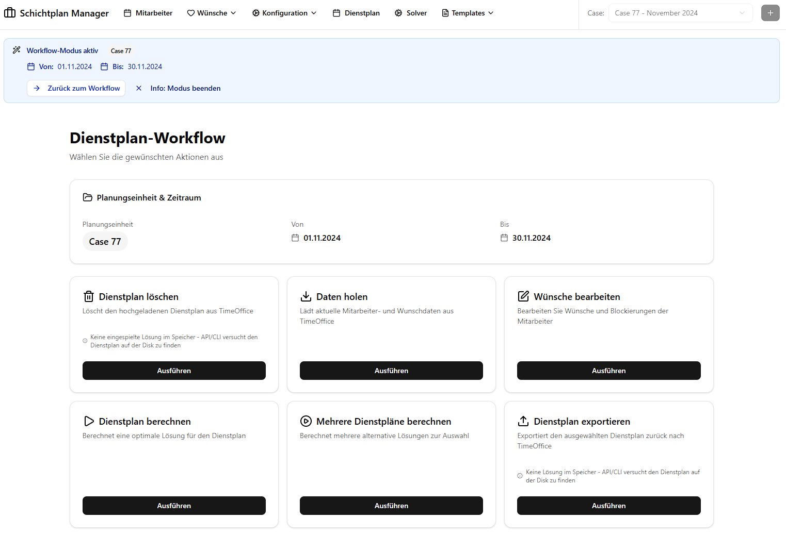
</figure>

#### Option B — Solver Page (Manual / Developer Mode)

The Solver page provides the same operations without requiring an active workflow session.
It is primarily intended for development, testing, and manual scheduling scenarios.

> **Important:** If you get an error message about the solver connection when entering this page, check your `config.json`
> settings and ensure the path to the StaffScheduling project is correct and that Python is properly installed.
> If you are using the API server, make sure it is running on the correct port e.g. `http://localhost:8000`.

<figure style={{ margin: "40px 0", marginLeft: "auto", marginRight: "auto" }}>
    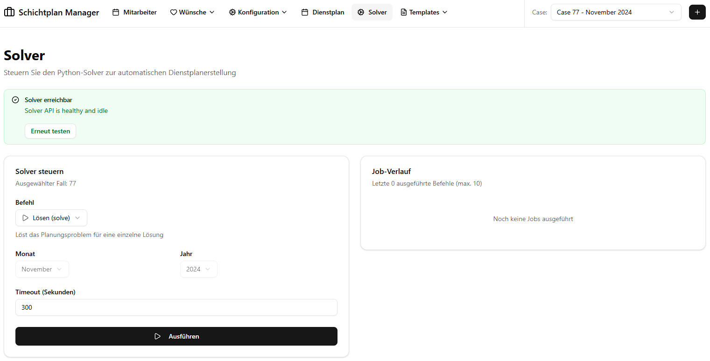
</figure>

#### Option C — Manual File Import

If you have already run the solver externally (e.g. on a different machine), you can import
the resulting `processed_solution_*.json` files directly on the **Schedule page** without
going through the solver operations at all (see Phase 6 — Manual Upload).

### Phase 6 — Compare & Select Schedules

After importing schedules, the Schedule page provides comprehensive analysis and selection tools.

#### Manual Upload

If you missed the automatic import prompt after a solve, or if you have externally generated
schedules, you can upload them manually:

1. Navigate to **"Dienstplan"** (Schedule).
2. Click **"Upload"** and select a `processed_solution_*.json` file from the solver's
   `processed_solutions/` output directory.

<figure style={{ margin: "40px 0", marginLeft: "auto", marginRight: "auto" }}>
    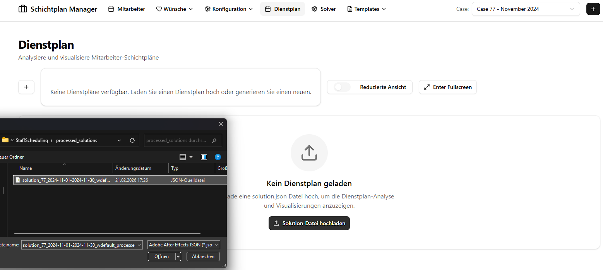
</figure>

#### Viewing a Schedule

Use the **Schedule Selector** dropdown to switch between all imported schedules for the current case.

The schedule matrix shows a day-by-day, employee-by-employee grid with colour-coded cells:

| Code | Shift | Description |
|---|---|---|
| **F** | Früh (Early) | Morning shift |
| **S** | Spät (Late) | Afternoon/evening shift |
| **N** | Nacht (Night) | Night shift |
| *(empty)* | Day off | No assignment |

The calendar view also renders wish and blocked information directly in the cells so you can
spot conflicts at a glance:

| Symbol | Meaning |
|---|---|
| ● Circle on a shift cell | Blocked shift (hard constraint) |
| ◆ Diamond on a shift cell | Wished shift (soft preference) |
| Red-highlighted day | Blocked day (employee must not work) |
| Small triangle indicator | Wish day (employee prefers to be off) |

<figure style={{ margin: "40px 0", marginLeft: "auto", marginRight: "auto" }}>
    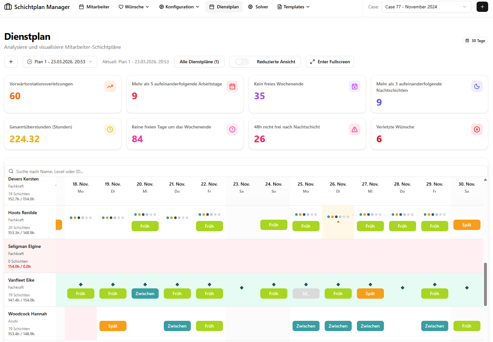
</figure>

#### Comparing Schedules

1. Click **"Alle Pläne"** (All Schedules) to open the overview dialog.
2. View quality statistics side by side for all imported schedules:

| Metric | Description | What to aim for |
|---|---|---|
| Forward Rotation Violations | Shifts should rotate F → S → N — violations of this rule | Lower is better |
| Consecutive Working Days > 5 | Employees working more than five days in a row | 0 is ideal |
| Free Weekend Violations | Weekends where no two consecutive free days were given | Lower is better |
| Free Days Near Weekend | Days off not grouped close to weekends | Lower is better |
| Not Free After Night Shift | Cases where no recovery day was granted after a night shift | 0 is ideal |
| Consecutive Night Shifts > 3 | Too many night shifts in a row | 0 is ideal |
| Total Overtime Hours | Sum of overtime across all employees | Lower is better |
| Violated Wishes | Number of soft-constraint wishes that could not be satisfied | Lower is better |

3. In the same dialog you can **add or edit a description** for each schedule to help distinguish
   them (e.g. "Variant with fewer night violations"), and **delete** schedules you no longer need.

> A schedule with 0 values for "Consecutive Night Shifts > 3", "Consecutive Working Days > 5",
> and "Not Free After Night Shift", combined with low overtime and few wish violations, is
> typically considered a good result.

<figure style={{ margin: "40px 0", marginLeft: "auto", marginRight: "auto" }}>
    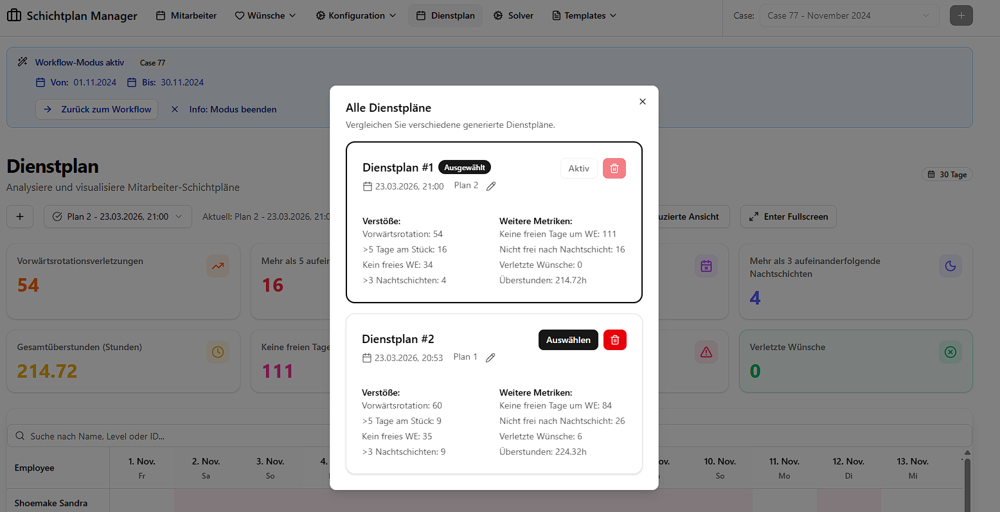
</figure>

#### Compact / Comparison Views

- **Compact view:** A condensed version of the shift matrix suitable for printing or quick review.
- **Compare view** ("Dienstpläne vergleichen"): Displays assigned shifts per employee stacked
  vertically across all loaded schedules, making it easy to spot per-employee differences between
  variants.

<figure style={{ margin: "40px 0", marginLeft: "auto", marginRight: "auto" }}>
    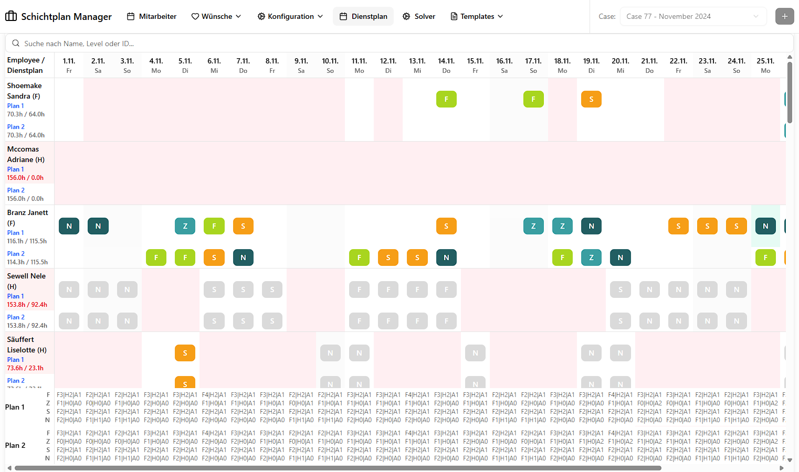
</figure>

#### Selecting the Optimal Schedule

After reviewing the metrics and visual matrix:

1. Choose the schedule that best balances low violations and high wish fulfillment.
2. Click **"Auswählen"** (Select) to mark it as the active schedule for this case.
3. The selected plan is persisted and will be used for the **Insert** operation (Phase 7).

> The selection is done in the same dialog as the comparison metrics, so you can make an informed decision based on the data and visualizations without needing to switch contexts.

### Phase 7 — Deploy the Schedule

After selecting the optimal schedule, use the **Insert** operation to write it back to TimeOffice:

1. Navigate to the **Solver** or **Workflow** page.
2. Click **"Einfügen"** (Insert). This writes the selected schedule to the TimeOffice database
    table `TPlanPersonalKommtGeht`.
3. Perform a final manual review in TimeOffice before publishing to staff.

If you need to undo the insertion, click **"Löschen"** (Delete) on the Solver page. This removes
the inserted rows from TimeOffice and resets the insertion state.

> **Note:** The Insert and Delete operations require a working connection to the TimeOffice
> database. The solver must be configured with valid database credentials in its `.env` file.

<figure style={{ margin: "40px 0", marginLeft: "auto", marginRight: "auto" }}>
    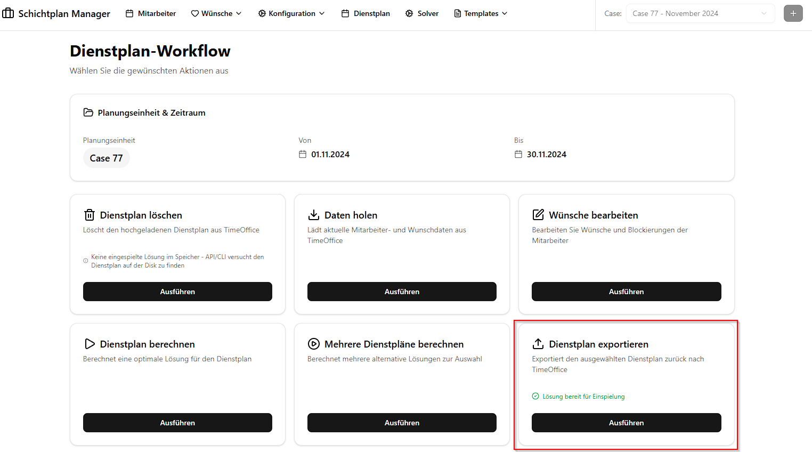
</figure>

---

## Quick Reference — Navigation Structure

| Page | Path | Purpose |
|---|---|---|
| Home | `/` | Case selection and overview |
| Employees | `/employees` | View employee roster |
| Wishes & Blocked | `/wishes-and-blocked` | Monthly per-employee preferences |
| Global Wishes | `/global-wishes-and-blocked` | Recurring weekly preferences |
| Weights | `/weights` | Solver constraint weights |
| Minimum Staff | `/minimal-staff` | Minimum staffing levels |
| Templates | `/templates` | Saved configuration presets |
| Schedule | `/schedule` | View, compare, and select schedules |
| Solver | `/solver` | Manual solver operations |
| Workflow | `/workflow` | Automated solver pipeline |